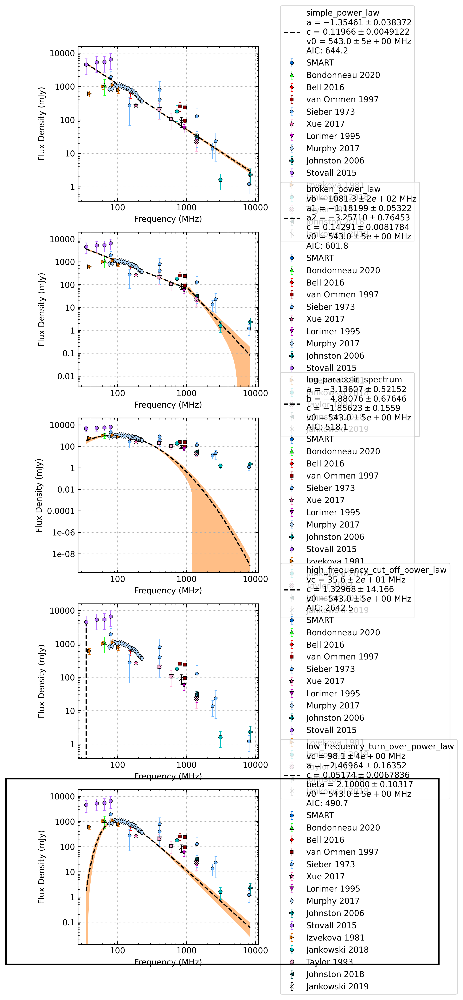

.. _J0630-2834:
J0630-2834
==========

Best Fit
--------
.. image:: best_fits/J0630-2834_log_parabolic_spectrum_fit.png
  :width: 800

.. csv-table:: J0630-2834 fit results
   :header: "model","a","b","c"

   "log_parabolic_spectrum","-1.99±0.03","-5.00±0.08","-3.06±0.03"

Fit Before MWA
--------------
.. image:: before_mwa/J0630-2834_broken_power_law_fit.png
  :width: 800

.. csv-table:: J0630-2834 before fit results
   :header: "model","vb (MHz)","a1","a2","b"

   "broken_power_law","135±0","-0.13±0.13","-1.64±0.08","0.70±0.21"

Flux Density Results
--------------------
.. csv-table:: J0630-2834 flux density total results
   :header: "N obs", "Flux Density (mJy)", "u_S_mean", "u_scint", "m_r_v"

   "2",  "940.8±352.6", "93.1", "451.7", "0.480"

.. csv-table:: J0630-2834 flux density individual results
   :header: "ObsID", "Flux Density (mJy)"

    "1258221008", "656.8±42.4"
    "1261241272", "1224.8±82.8"

Comparison Fit
--------------

Detection Plots
---------------

.. image:: detection_plots/1258221008_J0630-2834.prepfold.png
  :width: 800

.. image:: on_pulse_plots/1258221008_J0630-2834_1024_bins_gaussian_components.png
  :width: 800
.. image:: detection_plots/1261241272_J0630-2834.prepfold.png
  :width: 800

.. image:: on_pulse_plots/1261241272_J0630-2834_1024_bins_gaussian_components.png
  :width: 800