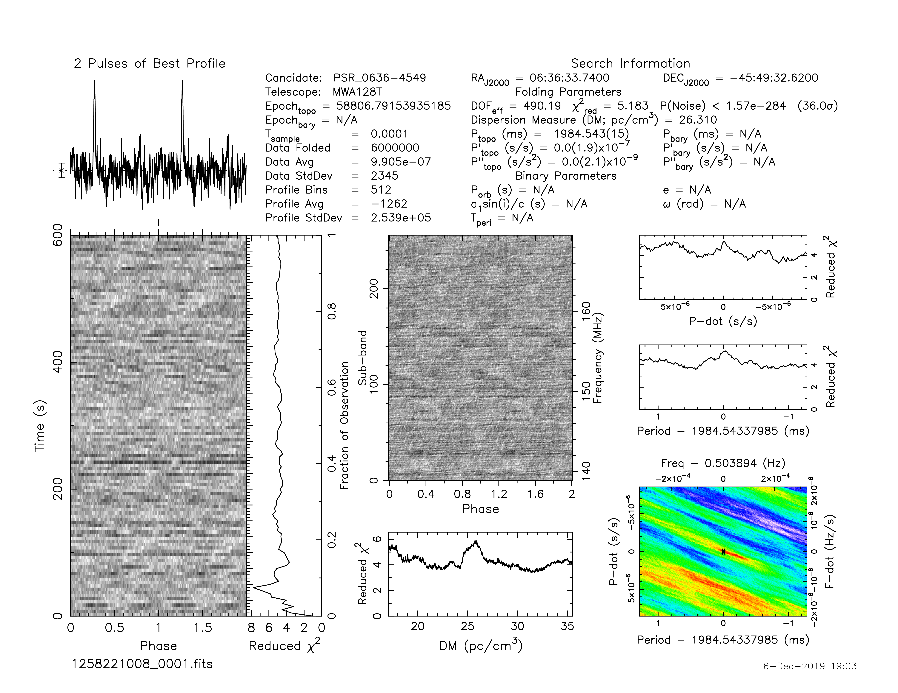

J0636-4549
==========

Flux Density Results
--------------------
.. csv-table:: J0636-4549 flux density total results
   :header: "N obs", "Flux Density (mJy)", " u_S_mean", "u_scint", "m_r_v"

   "1",  "16.7±10.5", "5.2", "9.1", "0.545"

.. csv-table:: J0636-4549 flux density individual results
   :header: "ObsID", "Flux Density (mJy)"

    "1257617424", "nan±nan"
    "1258221008", "16.7±5.2"

Comparison Fit
--------------
.. image:: comparison_fits/J0636-4549_comparison_fit.png
  :width: 800

Detection Plots
---------------

.. image:: on_pulse_plots/1258221008_J0636-4549_512_bins_gaussian_components.png
  :width: 800