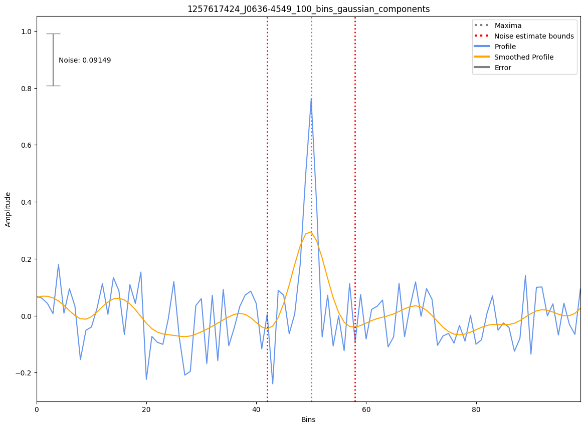

.. _J0636-4549:
J0636-4549
==========

Best Fit
--------
Only 2 MWA data and 1 cat data available

Flux Density Results
--------------------
.. csv-table:: J0636-4549 flux density total results
   :header: "N obs", "Flux Density (mJy)", "u_S_mean", "u_scint", "m_r_v"

   "2",  "18.6±11.4", "9.4", "10.1", "0.545"

.. csv-table:: J0636-4549 flux density individual results
   :header: "ObsID", "Flux Density (mJy)"

    "1257617424", "18.7±7.4"
    "1258221008", "18.6±5.8"

Detection Plots
---------------

.. image:: detection_plots/pf_1257617424_J0636-4549_06:36:33.74_-45:49:32.62_b100_1984.60ms_Cand.pfd.png
  :width: 800

.. image:: detection_plots/1258221008_J0636-4549.prepfold.png
  :width: 800

.. image:: on_pulse_plots/1258221008_J0636-4549_512_bins_gaussian_components.png
  :width: 800