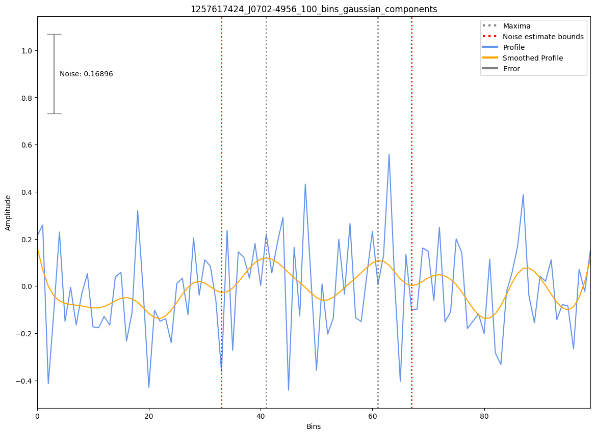

.. _J0702-4956:
J0702-4956
==========

Best Fit
--------
Only 1 MWA data and 1 cat data available

Flux Density Results
--------------------
.. csv-table:: J0702-4956 flux density total results
   :header: "N obs", "Flux Density (mJy)", "u_S_mean", "u_scint", "m_r_v"

   "1",  "15.5±6.7", "4.9", "4.5", "0.293"

.. csv-table:: J0702-4956 flux density individual results
   :header: "ObsID", "Flux Density (mJy)"

    "1257617424", "15.5±4.9"

Detection Plots
---------------

.. image:: detection_plots/pf_1257617424_J0702-4956_07:02:39.30_-49:56:34.20_b100_665.99ms_Cand.pfd.png
  :width: 800

