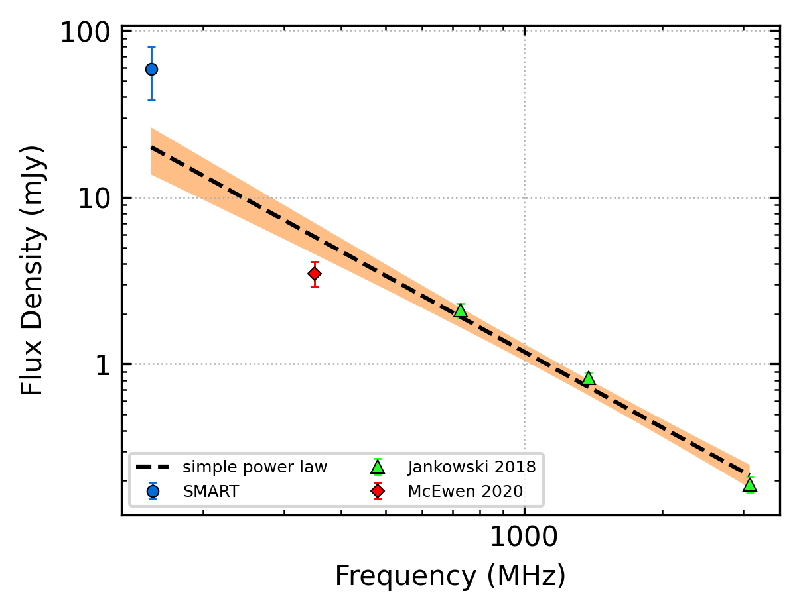
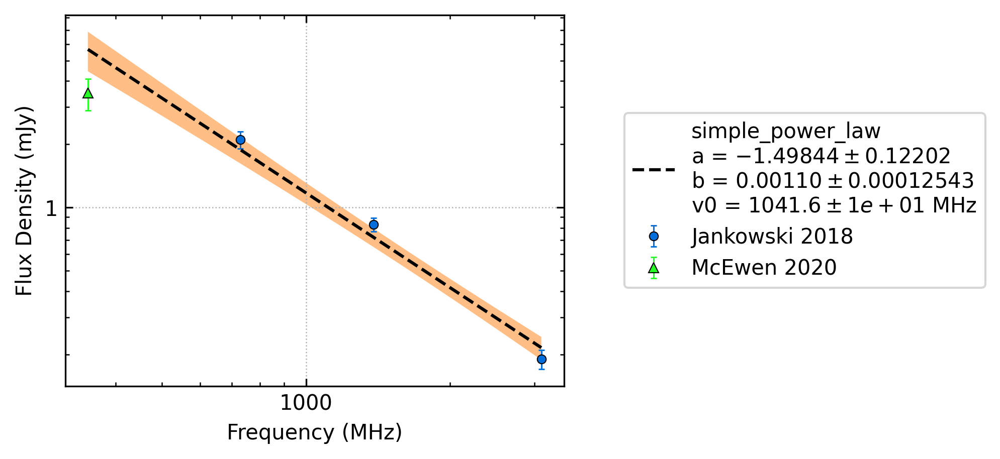
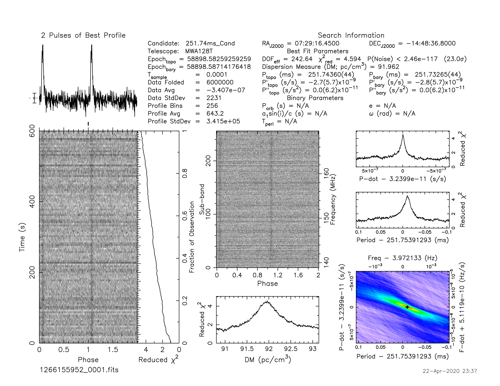
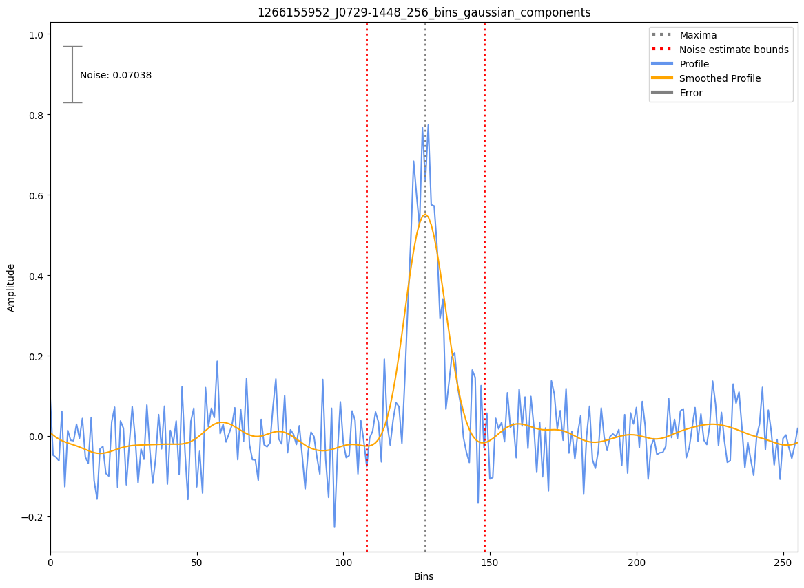

J0729-1448
==========

Best Fit
--------

.. csv-table:: J0729-1448 fit results
   :header: "model","a","b"

   "simple_power_law","-1.51±0.14","0.00±0.00"

Fit Before MWA
--------------

.. csv-table:: J0729-1448 before fit results
   :header: "model","a","b"

   "simple_power_law","-1.47±0.15","0.00±0.00"

Flux Density Results
--------------------
.. csv-table:: J0729-1448 flux density total results
   :header: "N obs", "Flux Density (mJy)", " u_S_mean", "u_scint", "m_r_v"

   "1",  "59.0±20.5", "10.1", "17.8", "0.303"

.. csv-table:: J0729-1448 flux density individual results
   :header: "ObsID", "Flux Density (mJy)"

    "1266155952", "59.0±10.1"

Comparison Fit
--------------
.. image:: comparison_fits/J0729-1448_comparison_fit.png
  :width: 800

Detection Plots
---------------

