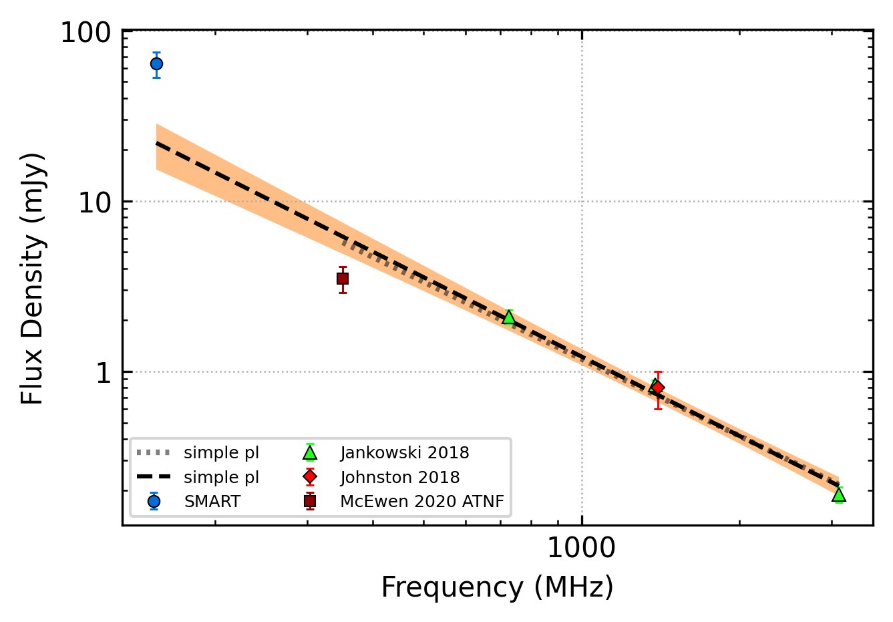
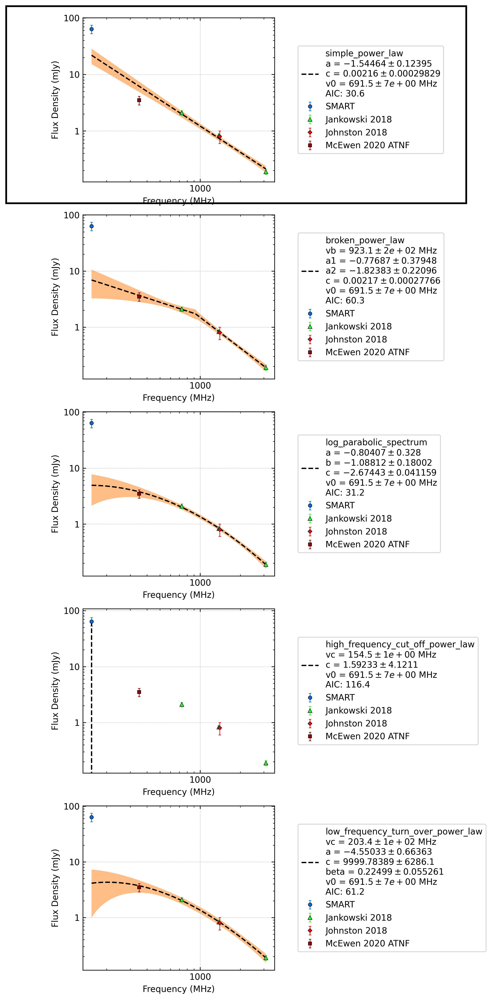

.. _J0729-1448:
J0729-1448
==========

Best Fit
--------

.. csv-table:: J0729-1448 fit results
   :header: "model","a","b","v0 (MHz)"

   "simple_power_law","-1.52±0.12","0.00±0.00","691±6"

Fit Before MWA
--------------

.. csv-table:: J0729-1448 before fit results
   :header: "model","a","b","v0 (MHz)"

   "simple_power_law","-1.50±0.12","0.00±0.00","1041±10"

Flux Density Results
--------------------
.. csv-table:: J0729-1448 flux density total results
   :header: "N obs", "Flux Density (mJy)", "u_S_mean", "u_scint", "m_r_v"

   "1",  "63.8±22.2", "11.0", "19.3", "0.303"

.. csv-table:: J0729-1448 flux density individual results
   :header: "ObsID", "Flux Density (mJy)"

    "1266155952", "63.8±11.0"

Comparison Fit
--------------

Detection Plots
---------------

.. image:: detection_plots/1266155952_J0729-1448.prepfold.png
  :width: 800

.. image:: on_pulse_plots/1266155952_J0729-1448_256_bins_gaussian_components.png
  :width: 800