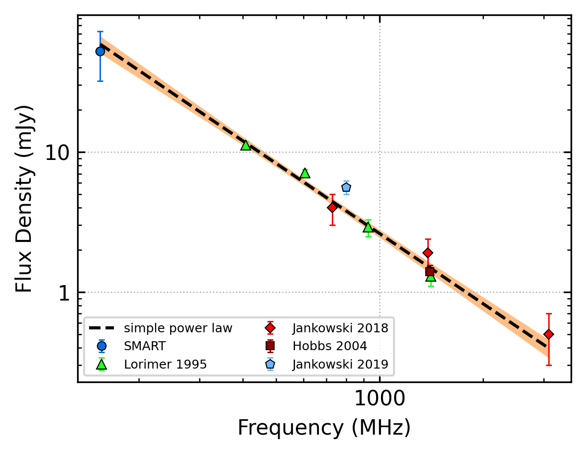
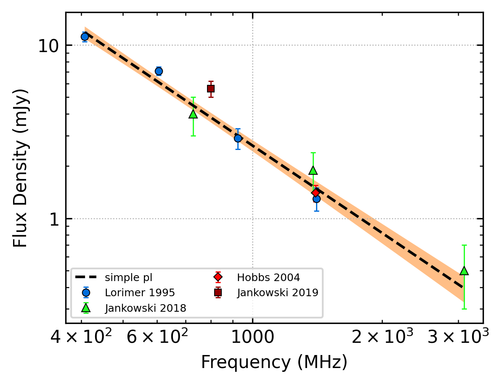

J0729-1836
==========

Best Fit
--------

.. csv-table:: J0729-1836 fit results
   :header: "model","a","b"

   "simple_power_law","-1.67±0.09","0.00±0.00"

Fit Before MWA
--------------

.. csv-table:: J0729-1836 before fit results
   :header: "model","a","b"

   "simple_power_law","-1.68±0.10","0.00±0.00"

Flux Density Results
--------------------
.. csv-table:: J0729-1836 flux density total results
   :header: "N obs", "Flux Density (mJy)", "u_S_mean", "u_scint", "m_r_v"

   "2",  "52.3±20.3", "13.4", "19.2", "0.366"

.. csv-table:: J0729-1836 flux density individual results
   :header: "ObsID", "Flux Density (mJy)"

    "1261241272", "38.0±8.6"
    "1266155952", "66.7±10.2"

Comparison Fit
--------------
.. image:: comparison_fits/J0729-1836_comparison_fit.png
  :width: 800

Detection Plots
---------------

.. image:: detection_plots/1261241272_J0729-1836.prepfold.png
  :width: 800

.. image:: on_pulse_plots/1261241272_J0729-1836_100_bins_gaussian_components.png
  :width: 800
.. image:: detection_plots/1266155952_J0729-1836.prepfold.png
  :width: 800

.. image:: on_pulse_plots/1266155952_J0729-1836_256_bins_gaussian_components.png
  :width: 800