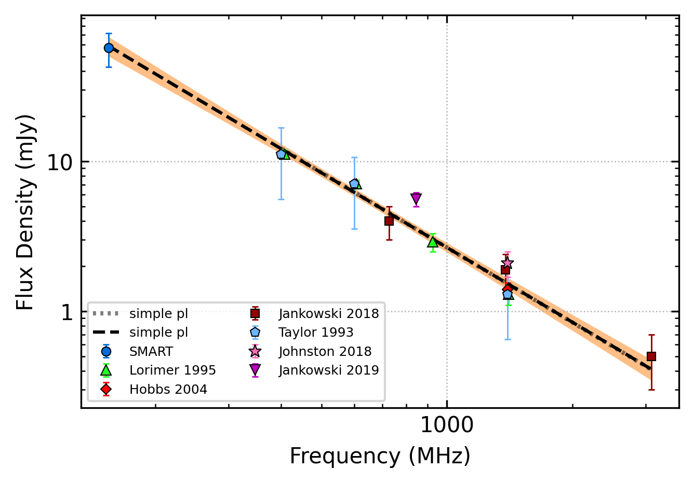

.. _J0729-1836:
J0729-1836
==========

Best Fit
--------

.. csv-table:: J0729-1836 fit results
   :header: "model","vb (MHz)","a1","a2","c","v0 (MHz)"

   "broken_power_law","442±29","1.57±1.72","-1.87±0.16","0.03±0.03","691±6"

Fit Before MWA
--------------

.. csv-table:: J0729-1836 before fit results
   :header: "model","vpeak (MHz)","a","c","beta","v0 (MHz)"

   "low_frequency_turn_over_power_law","373±40","-2.30±0.27","0.00±0.00","2.10±1.51","1041±10"

Flux Density Results
--------------------
.. csv-table:: J0729-1836 flux density total results
   :header: "N obs", "Flux Density (mJy)", "u_S_mean", "u_scint", "m_r_v"

   "2",  "57.1±22.0", "14.6", "20.9", "0.366"

.. csv-table:: J0729-1836 flux density individual results
   :header: "ObsID", "Flux Density (mJy)"

    "1261241272", "41.9±9.5"
    "1266155952", "72.2±11.0"

Comparison Fit
--------------
.. image:: comparison_fits/J0729-1836_comparison_fit.png
  :width: 800

Detection Plots
---------------

.. image:: on_pulse_plots/1261241272_J0729-1836_100_bins_gaussian_components.png
  :width: 800

.. image:: on_pulse_plots/1266155952_J0729-1836_256_bins_gaussian_components.png
  :width: 800