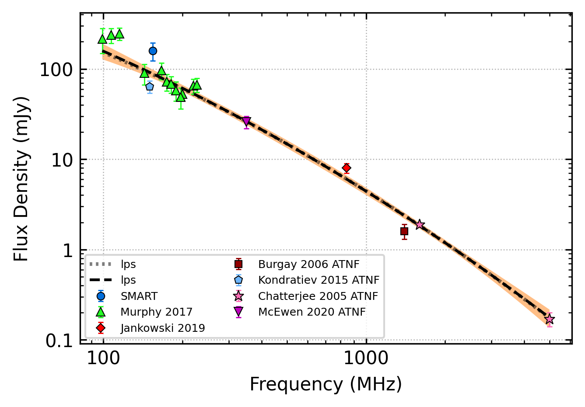

.. _J0737-3039A:
J0737-3039A
===========

Best Fit
--------

.. csv-table:: J0737-3039A fit results
   :header: "model","vb (MHz)","a1","a2","c","v0 (MHz)"

   "broken_power_law","843±29","-1.46±0.09","-2.15±0.16","0.01±0.00","703±7"

Fit Before MWA
--------------

.. csv-table:: J0737-3039A before fit results
   :header: "model","vb (MHz)","a1","a2","c","v0 (MHz)"

   "broken_power_law","843±1","-1.45±0.09","-2.16±0.16","0.01±0.00","703±7"

Flux Density Results
--------------------
.. csv-table:: J0737-3039A flux density total results
   :header: "N obs", "Flux Density (mJy)", "u_S_mean", "u_scint", "m_r_v"

   "2",  "158.6±54.9", "35.5", "64.5", "0.407"

.. csv-table:: J0737-3039A flux density individual results
   :header: "ObsID", "Flux Density (mJy)"

    "1258221008", "144.2±22.3"
    "1261241272", "172.9±27.6"

Comparison Fit
--------------
.. image:: comparison_fits/J0737-3039A_comparison_fit.png
  :width: 800

Detection Plots
---------------

.. image:: detection_plots/1258221008_J0737-3039A.prepfold.png
  :width: 800

.. image:: on_pulse_plots/1258221008_J0737-3039A_100_bins_gaussian_components.png
  :width: 800

.. image:: on_pulse_plots/1261241272_J0737-3039A_100_bins_gaussian_components.png
  :width: 800