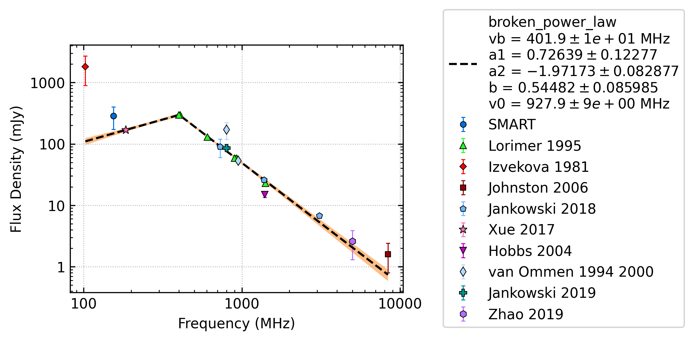
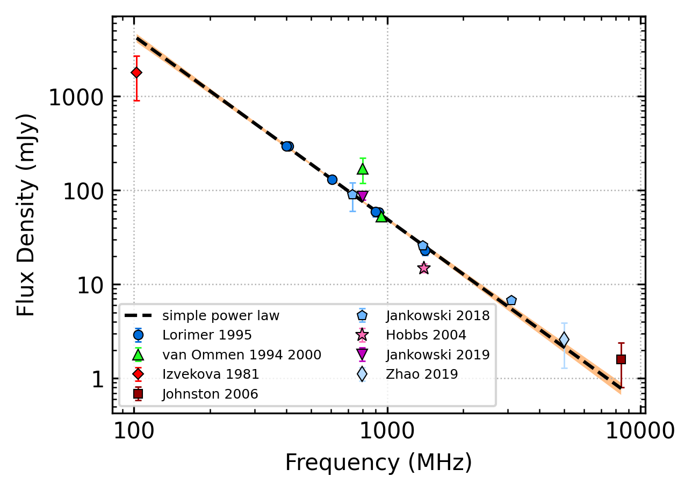

J0742-2822
==========

Best Fit
--------

.. csv-table:: J0742-2822 fit results
   :header: "model","vb (MHz)","a1","a2","b"

   "broken_power_law","402±12","0.08±0.39","-1.98±0.07","0.33±0.15"

Fit Before MWA
--------------

.. csv-table:: J0742-2822 before fit results
   :header: "model","a","b"

   "simple_power_law","-1.95±0.06","0.03±0.00"

Flux Density Results
--------------------
.. csv-table:: J0742-2822 flux density total results
   :header: "N obs", "Flux Density (mJy)", " u_S_mean", "u_scint", "m_r_v"

   "4",  "259.3±99.9", "45.3", "87.0", "0.336"

.. csv-table:: J0742-2822 flux density individual results
   :header: "ObsID", "Flux Density (mJy)"

    "1261241272", "446.6±23.0"
    "1265983624", "57.4±8.0"
    "1266155952", "208.4±13.3"
    "1265470568", "324.7±35.8"

Comparison Fit
--------------
.. image:: comparison_fits/J0742-2822_comparison_fit.png
  :width: 800

Detection Plots
---------------

.. image:: detection_plots/1261241272_J0742-2822.prepfold.png
  :width: 800

.. image:: on_pulse_plots/1261241272_J0742-2822_1024_bins_gaussian_components.png
  :width: 800
.. image:: detection_plots/1265983624_J0742-2822.prepfold.png
  :width: 800

.. image:: on_pulse_plots/1265983624_J0742-2822_256_bins_gaussian_components.png
  :width: 800
.. image:: detection_plots/1266155952_J0742-2822.prepfold.png
  :width: 800

.. image:: on_pulse_plots/1266155952_J0742-2822_1024_bins_gaussian_components.png
  :width: 800
.. image:: detection_plots/1265470568_J0742-2822.prepfold.png
  :width: 800

.. image:: on_pulse_plots/1265470568_J0742-2822_256_bins_gaussian_components.png
  :width: 800