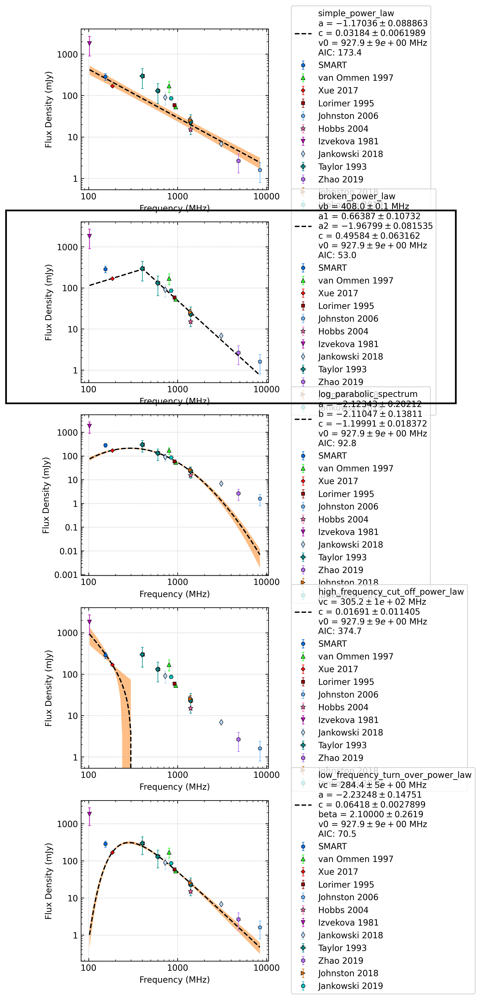

.. _J0742-2822:
J0742-2822
==========

Best Fit
--------
.. image:: best_fits/J0742-2822_broken_power_law_fit.png
  :width: 800

.. csv-table:: J0742-2822 fit results
   :header: "model","vb (MHz)","a1","a2","b","v0 (MHz)"

   "broken_power_law","401±12","0.73±0.12","-1.97±0.08","0.54±0.09","927±9"

Fit Before MWA
--------------
.. image:: before_mwa/J0742-2822_broken_power_law_fit.png
  :width: 800

.. csv-table:: J0742-2822 before fit results
   :header: "model","vb (MHz)","a1","a2","b","v0 (MHz)"

   "broken_power_law","401±12","0.73±0.12","-1.97±0.08","0.55±0.09","927±9"

Flux Density Results
--------------------
.. csv-table:: J0742-2822 flux density total results
   :header: "N obs", "Flux Density (mJy)", "u_S_mean", "u_scint", "m_r_v"

   "4",  "286.2±112.7", "50.2", "96.1", "0.336"

.. csv-table:: J0742-2822 flux density individual results
   :header: "ObsID", "Flux Density (mJy)"

    "1261241272", "493.4±25.4"
    "1265983624", "64.0±8.9"
    "1266155952", "225.5±14.4"
    "1265470568", "361.9±39.9"

Comparison Fit
--------------

Detection Plots
---------------

.. image:: on_pulse_plots/1261241272_J0742-2822_1024_bins_gaussian_components.png
  :width: 800
.. image:: detection_plots/1265983624_J0742-2822.prepfold.png
  :width: 800

.. image:: on_pulse_plots/1265983624_J0742-2822_256_bins_gaussian_components.png
  :width: 800

.. image:: on_pulse_plots/1266155952_J0742-2822_1024_bins_gaussian_components.png
  :width: 800

.. image:: on_pulse_plots/1265470568_J0742-2822_256_bins_gaussian_components.png
  :width: 800