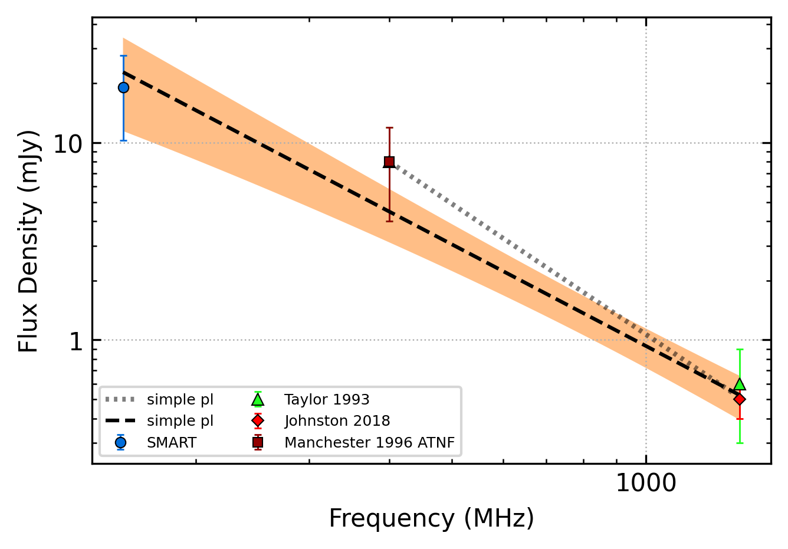
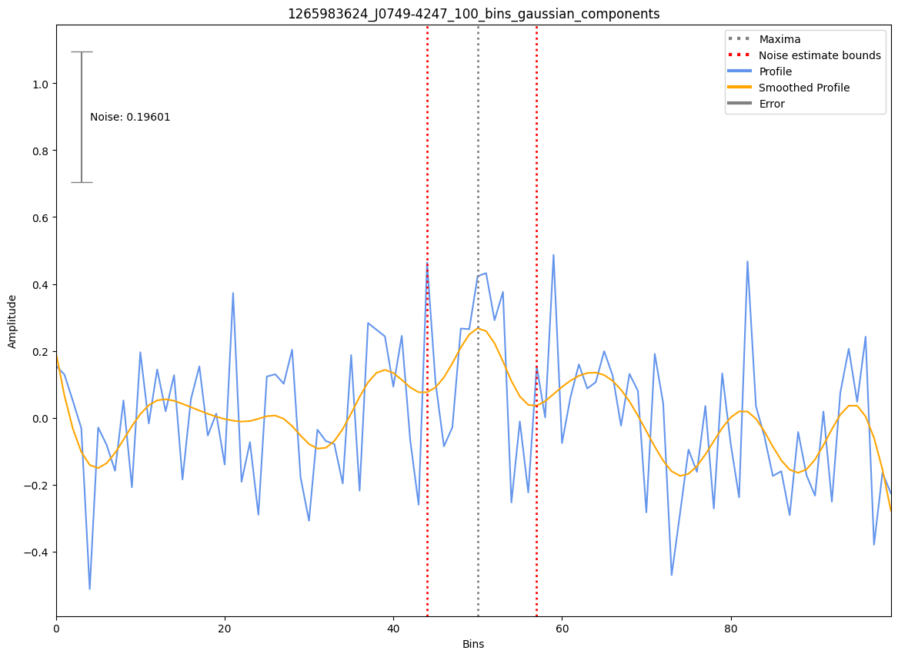

.. _J0749-4247:
J0749-4247
==========

Best Fit
--------

.. csv-table:: J0749-4247 fit results
   :header: "model","a","c","v0 (MHz)"

   "simple_power_law","-1.71±0.25","0.00±0.00","464±4"

Fit Before MWA
--------------

.. csv-table:: J0749-4247 before fit results
   :header: "model","a","c","v0 (MHz)"

   "simple_power_law","-2.20±0.45","0.00±0.00","748±7"

Flux Density Results
--------------------
.. csv-table:: J0749-4247 flux density total results
   :header: "N obs", "Flux Density (mJy)", "u_S_mean", "u_scint", "m_r_v"

   "1",  "19.0±10.3", "8.7", "5.4", "0.285"

.. csv-table:: J0749-4247 flux density individual results
   :header: "ObsID", "Flux Density (mJy)"

    "1265983624", "19.0±8.7"

Comparison Fit
--------------
.. image:: comparison_fits/J0749-4247_comparison_fit.png
  :width: 800

Detection Plots
---------------

.. image:: detection_plots/pf_1265983624_J0749-4247_07:49:49.67_-42:47:42.14_b100_1095.45ms_Cand.pfd.png
  :width: 800

