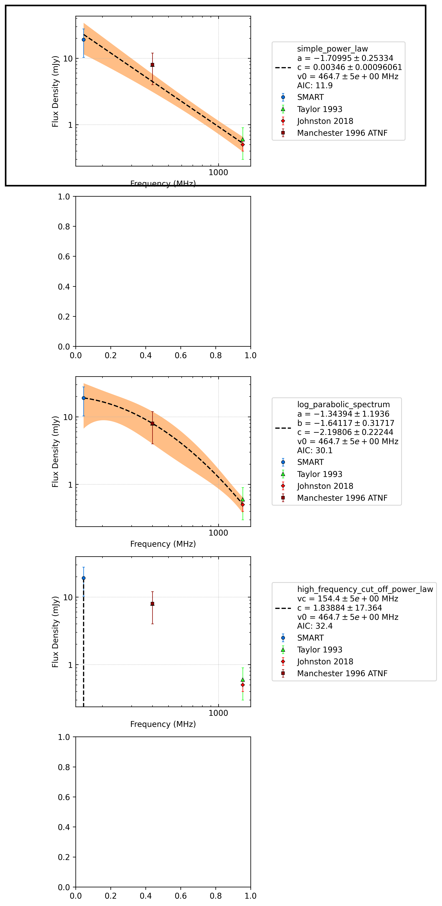

J0749-4247
==========

Best Fit
--------
.. image:: best_fits/J0749-4247_broken_power_law_fit.png
  :width: 800

.. csv-table:: J0749-4247 fit results
   :header: "model","vb (MHz)","a1","a2","b"

   "broken_power_law","402±12","0.08±0.39","-1.98±0.07","0.33±0.15"

Flux Density Results
--------------------
.. csv-table:: J0749-4247 flux density total results
   :header: "N obs", "Flux Density (mJy)", " u_S_mean", "u_scint", "m_r_v"

   "0",  "259.3±99.9", "45.3", "87.0", "0.336"

.. csv-table:: J0749-4247 flux density individual results
   :header: "ObsID", "Flux Density (mJy)"

    "1265983624", "nan±nan"

Comparison Fit
--------------

Detection Plots
---------------
