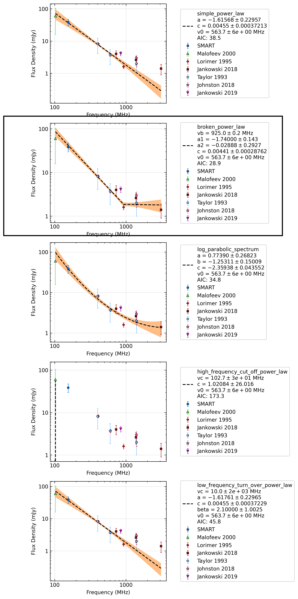

J0758-1528
==========

Best Fit
--------
.. image:: best_fits/J0758-1528_simple_power_law_fit.png
  :width: 800

.. csv-table:: J0758-1528 fit results
   :header: "model","a","b"

   "simple_power_law","-1.67±0.20","0.00±0.00"

Fit Before MWA
--------------
.. image:: before_mwa/J0758-1528_simple_power_law_fit.png
  :width: 800

.. csv-table:: J0758-1528 before fit results
   :header: "model","a","b"

   "simple_power_law","-1.71±0.24","0.00±0.00"

Flux Density Results
--------------------
.. csv-table:: J0758-1528 flux density total results
   :header: "N obs", "Flux Density (mJy)", "u_S_mean", "u_scint", "m_r_v"

   "1",  "35.7±15.2", "8.1", "12.9", "0.361"

.. csv-table:: J0758-1528 flux density individual results
   :header: "ObsID", "Flux Density (mJy)"

    "1266155952", "35.7±8.1"

Comparison Fit
--------------

Detection Plots
---------------

.. image:: detection_plots/1266155952_J0758-1528.prepfold.png
  :width: 800

.. image:: on_pulse_plots/1266155952_J0758-1528_512_bins_gaussian_components.png
  :width: 800