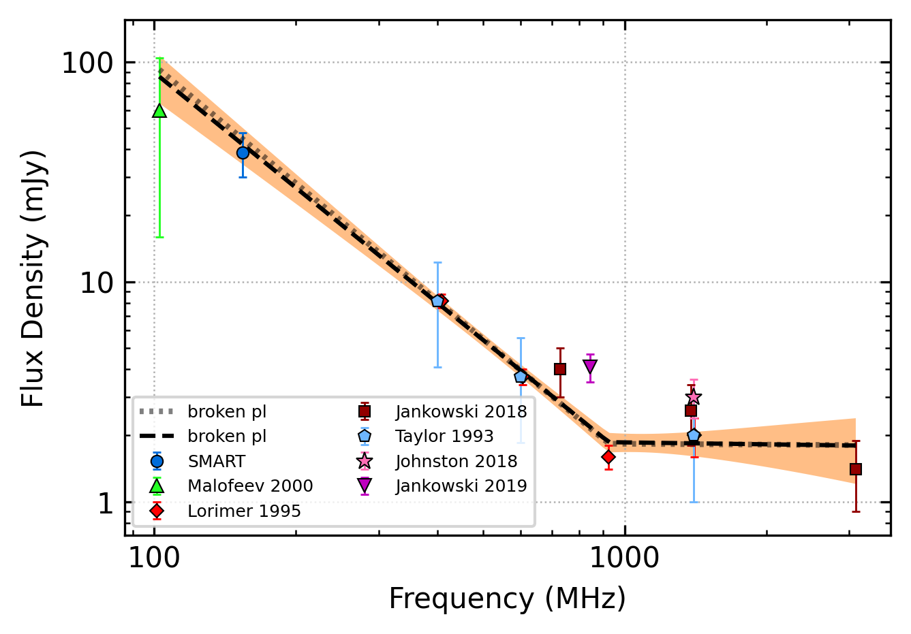

.. _J0758-1528:
J0758-1528
==========

Best Fit
--------

.. csv-table:: J0758-1528 fit results
   :header: "model","a","c","v0 (MHz)"

   "simple_power_law","-0.67±0.26","0.00±0.00","563±5"

Fit Before MWA
--------------

.. csv-table:: J0758-1528 before fit results
   :header: "model","a","c","v0 (MHz)"

   "simple_power_law","-0.64±0.24","0.00±0.00","563±5"

Flux Density Results
--------------------
.. csv-table:: J0758-1528 flux density total results
   :header: "N obs", "Flux Density (mJy)", "u_S_mean", "u_scint", "m_r_v"

   "1",  "38.7±16.5", "8.8", "13.9", "0.361"

.. csv-table:: J0758-1528 flux density individual results
   :header: "ObsID", "Flux Density (mJy)"

    "1266155952", "38.7±8.8"

Comparison Fit
--------------
.. image:: comparison_fits/J0758-1528_comparison_fit.png
  :width: 800

Detection Plots
---------------

.. image:: detection_plots/1266155952_J0758-1528.prepfold.png
  :width: 800

.. image:: on_pulse_plots/1266155952_J0758-1528_512_bins_gaussian_components.png
  :width: 800