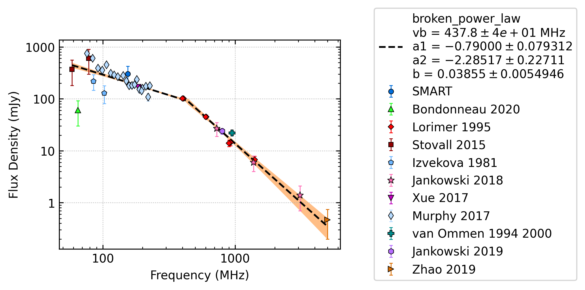
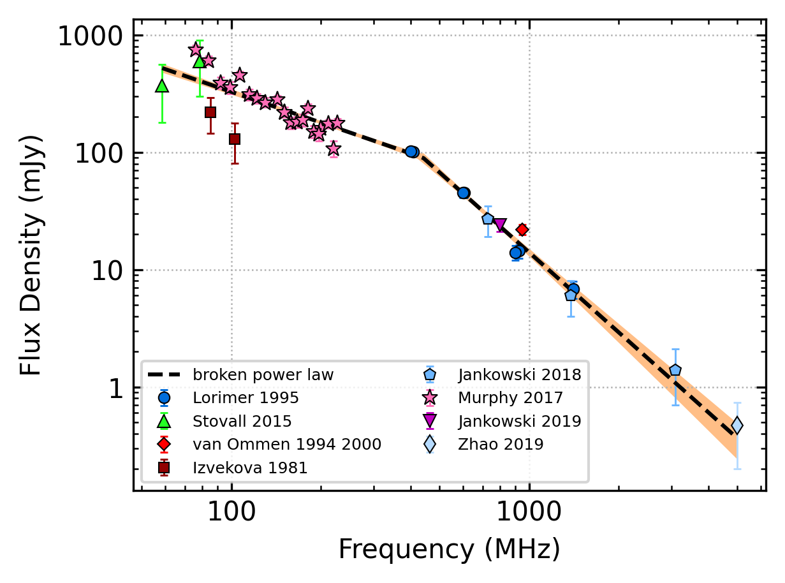
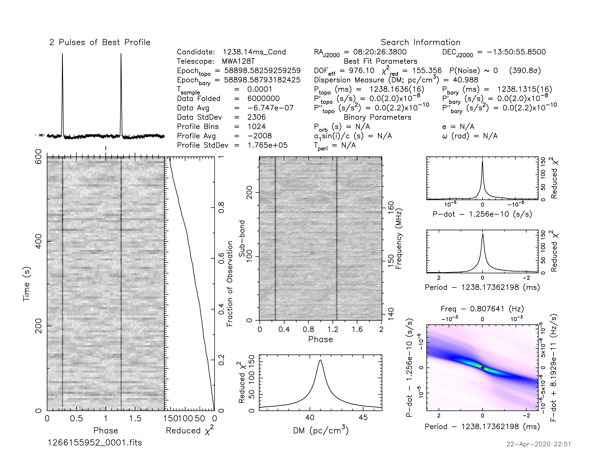
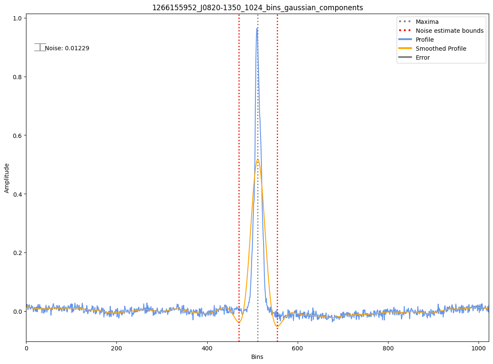
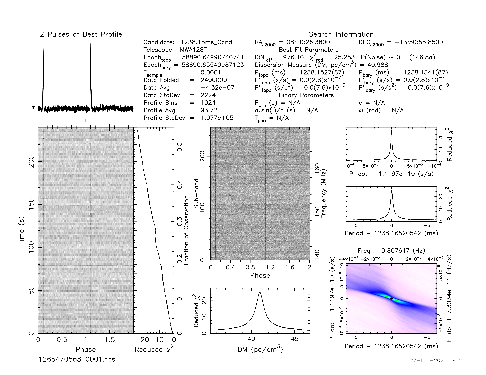
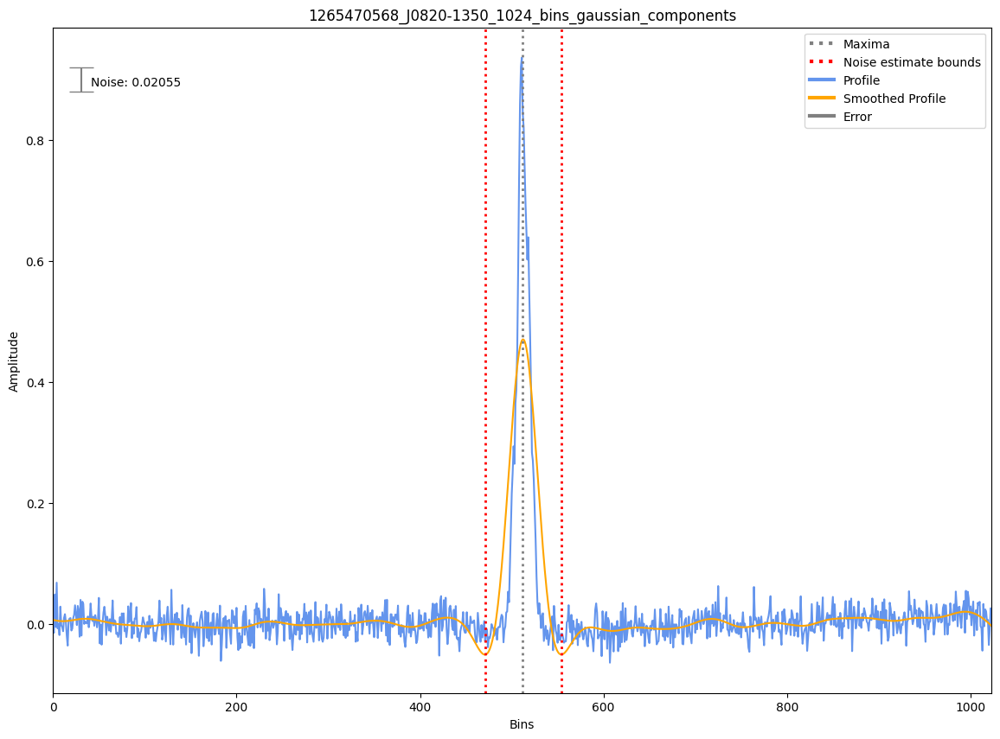

J0820-1350
==========

Best Fit
--------

.. csv-table:: J0820-1350 fit results
   :header: "model","vb (MHz)","a1","a2","b"

   "broken_power_law","440±37","-0.87±0.07","-2.27±0.17","0.03±0.00"

Fit Before MWA
--------------

.. csv-table:: J0820-1350 before fit results
   :header: "model","vb (MHz)","a1","a2","b"

   "broken_power_law","440±37","-0.87±0.07","-2.27±0.17","0.04±0.00"

Flux Density Results
--------------------
.. csv-table:: J0820-1350 flux density total results
   :header: "N obs", "Flux Density (mJy)", "u_S_mean", "u_scint", "m_r_v"

   "2",  "277.9±113.7", "49.8", "123.0", "0.443"

.. csv-table:: J0820-1350 flux density individual results
   :header: "ObsID", "Flux Density (mJy)"

    "1261241272", "nan±nan"
    "1266155952", "379.9±44.8"
    "1265470568", "175.9±21.8"

Comparison Fit
--------------
.. image:: comparison_fits/J0820-1350_comparison_fit.png
  :width: 800

Detection Plots
---------------

