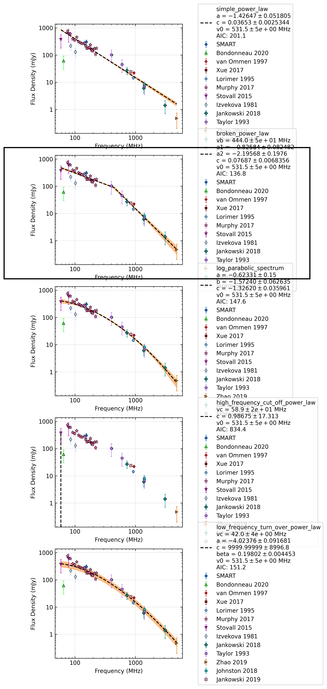

.. _J0820-1350:
J0820-1350
==========

Best Fit
--------
.. image:: best_fits/J0820-1350_broken_power_law_fit.png
  :width: 800

.. csv-table:: J0820-1350 fit results
   :header: "model","vb (MHz)","a1","a2","b","v0 (MHz)"

   "broken_power_law","437±44","-0.79±0.08","-2.29±0.23","0.08±0.01","541±5"

Fit Before MWA
--------------
.. image:: before_mwa/J0820-1350_broken_power_law_fit.png
  :width: 800

.. csv-table:: J0820-1350 before fit results
   :header: "model","vb (MHz)","a1","a2","b","v0 (MHz)"

   "broken_power_law","437±44","-0.79±0.08","-2.29±0.23","0.08±0.01","541±5"

Flux Density Results
--------------------
.. csv-table:: J0820-1350 flux density total results
   :header: "N obs", "Flux Density (mJy)", "u_S_mean", "u_scint", "m_r_v"

   "2",  "303.6±122.6", "54.2", "134.4", "0.443"

.. csv-table:: J0820-1350 flux density individual results
   :header: "ObsID", "Flux Density (mJy)"

    "1261241272", "nan±nan"
    "1266155952", "411.0±48.4"
    "1265470568", "196.3±24.3"

Comparison Fit
--------------

Detection Plots
---------------

.. image:: detection_plots/1266155952_J0820-1350.prepfold.png
  :width: 800

.. image:: on_pulse_plots/1266155952_J0820-1350_1024_bins_gaussian_components.png
  :width: 800

.. image:: on_pulse_plots/1265470568_J0820-1350_1024_bins_gaussian_components.png
  :width: 800