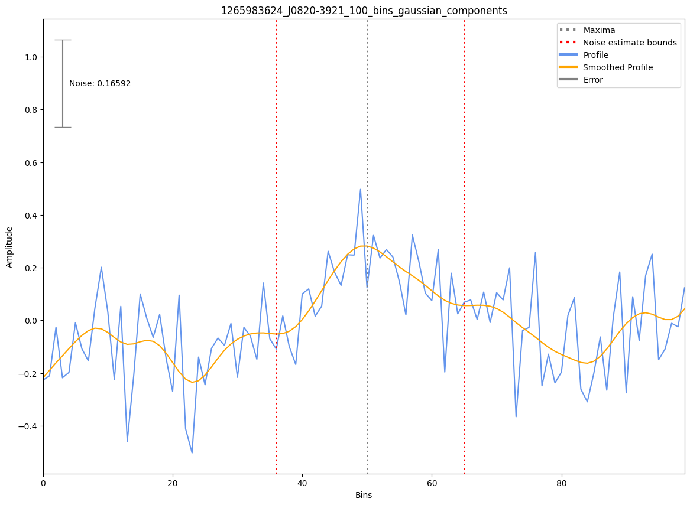

.. _J0820-3921:
J0820-3921
==========

Best Fit
--------
.. image:: best_fits/J0820-3921_i_fit.png
  :width: 800

.. csv-table:: J0820-3921 fit results
   :header: "model","a","b","v0 (MHz)"

   "i","-1.98±0.12","0.00±0.00","464±4"

Fit Before MWA
--------------

.. csv-table:: J0820-3921 before fit results
   :header: "model","a","b","v0 (MHz)"

   "i","-1.95±0.14","0.00±0.00","700±7"

Flux Density Results
--------------------
.. csv-table:: J0820-3921 flux density total results
   :header: "N obs", "Flux Density (mJy)", "u_S_mean", "u_scint", "m_r_v"

   "1",  "51.0±15.9", "11.2", "11.3", "0.221"

.. csv-table:: J0820-3921 flux density individual results
   :header: "ObsID", "Flux Density (mJy)"

    "1265983624", "51.0±11.2"

Comparison Fit
--------------
.. image:: comparison_fits/J0820-3921_comparison_fit.png
  :width: 800

Detection Plots
---------------

