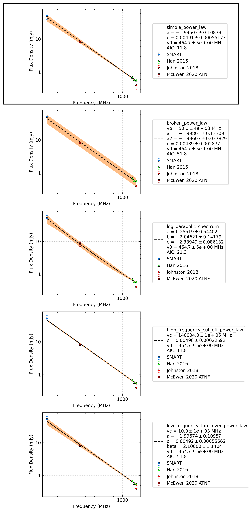

J0820-3921
==========

Best Fit
--------
.. image:: best_fits/J0820-3921_broken_power_law_fit.png
  :width: 800

.. csv-table:: J0820-3921 fit results
   :header: "model","vb (MHz)","a1","a2","b"

   "broken_power_law","440±37","-0.87±0.07","-2.27±0.17","0.03±0.00"

Fit Before MWA
--------------
.. image:: before_mwa/J0820-3921_simple_power_law_fit.png
  :width: 800

.. csv-table:: J0820-3921 before fit results
   :header: "model","a","b"

   "simple_power_law","-1.95±0.10","0.00±0.00"

Flux Density Results
--------------------
.. csv-table:: J0820-3921 flux density total results
   :header: "N obs", "Flux Density (mJy)", " u_S_mean", "u_scint", "m_r_v"

   "0",  "277.9±113.7", "49.8", "123.0", "0.443"

.. csv-table:: J0820-3921 flux density individual results
   :header: "ObsID", "Flux Density (mJy)"

    "1265983624", "nan±nan"

Comparison Fit
--------------

Detection Plots
---------------
