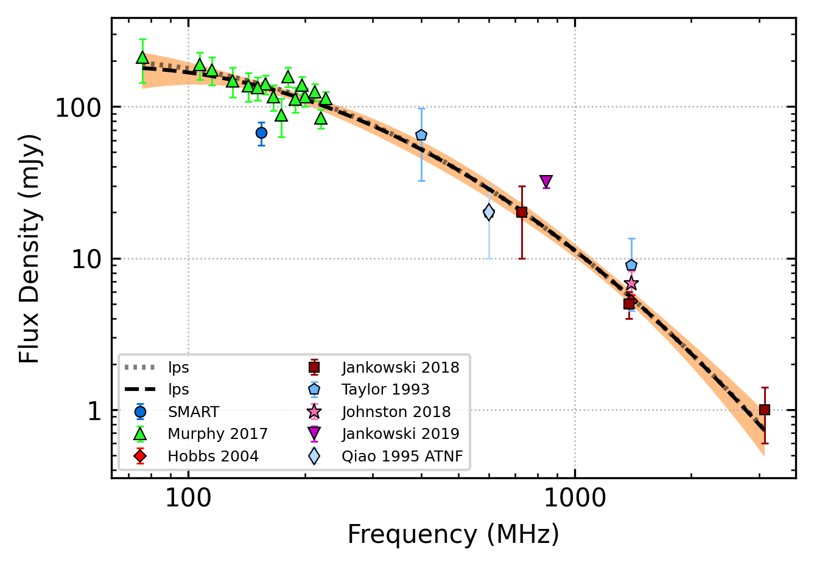

.. _J0820-4114:
J0820-4114
==========

Best Fit
--------

.. csv-table:: J0820-4114 fit results
   :header: "model","vb (MHz)","a1","a2","c","v0 (MHz)"

   "broken_power_law","507±156","-0.74±0.22","-2.32±0.42","0.06±0.01","485±4"

Fit Before MWA
--------------

.. csv-table:: J0820-4114 before fit results
   :header: "model","vpeak (MHz)","a","c","beta","v0 (MHz)"

   "low_frequency_turn_over_power_law","68±5","-6.04±0.12","436282712004.53±303605772074.01","0.15±0.00","485±4"

Flux Density Results
--------------------
.. csv-table:: J0820-4114 flux density total results
   :header: "N obs", "Flux Density (mJy)", "u_S_mean", "u_scint", "m_r_v"

   "2",  "67.1±27.3", "11.6", "18.4", "0.274"

.. csv-table:: J0820-4114 flux density individual results
   :header: "ObsID", "Flux Density (mJy)"

    "1265983624", "100.7±9.0"
    "1265470568", "33.6±7.3"

Comparison Fit
--------------
.. image:: comparison_fits/J0820-4114_comparison_fit.png
  :width: 800

Detection Plots
---------------

.. image:: detection_plots/1265983624_J0820-4114.prepfold.png
  :width: 800

.. image:: on_pulse_plots/1265983624_J0820-4114_512_bins_gaussian_components.png
  :width: 800
.. image:: detection_plots/1265470568_J0820-4114.prepfold.png
  :width: 800

.. image:: on_pulse_plots/1265470568_J0820-4114_128_bins_gaussian_components.png
  :width: 800