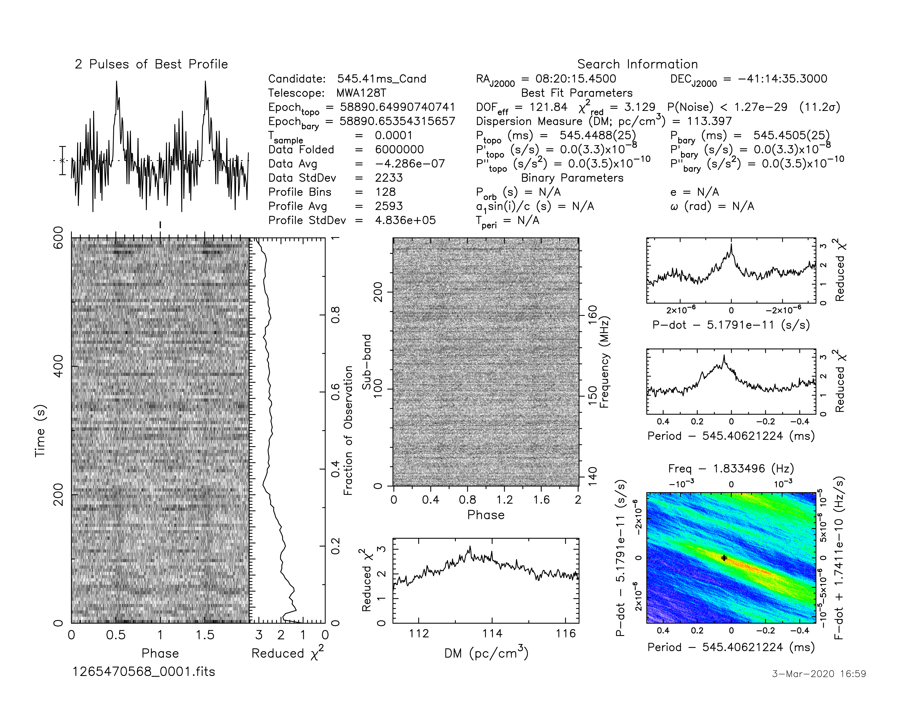

J0820-4114
==========

Best Fit
--------
.. image:: best_fits/J0820-4114_log_parabolic_spectrum_fit.png
  :width: 800

.. csv-table:: J0820-4114 fit results
   :header: "model","a","b","c"

   "log_parabolic_spectrum","-0.87±0.25","-2.25±0.23","-2.20±0.04"

Fit Before MWA
--------------
.. image:: before_mwa/J0820-4114_log_parabolic_spectrum_fit.png
  :width: 800

.. csv-table:: J0820-4114 before fit results
   :header: "model","a","b","c"

   "log_parabolic_spectrum","-0.86±0.23","-2.25±0.22","-2.20±0.04"

Flux Density Results
--------------------
.. csv-table:: J0820-4114 flux density total results
   :header: "N obs", "Flux Density (mJy)", "u_S_mean", "u_scint", "m_r_v"

   "2",  "60.3±24.5", "10.4", "16.5", "0.274"

.. csv-table:: J0820-4114 flux density individual results
   :header: "ObsID", "Flux Density (mJy)"

    "1265983624", "90.5±8.1"
    "1265470568", "30.1±6.5"

Comparison Fit
--------------
.. image:: comparison_fits/J0820-4114_comparison_fit.png
  :width: 800

Detection Plots
---------------

.. image:: detection_plots/1265983624_J0820-4114.prepfold.png
  :width: 800

.. image:: on_pulse_plots/1265983624_J0820-4114_512_bins_gaussian_components.png
  :width: 800

.. image:: on_pulse_plots/1265470568_J0820-4114_128_bins_gaussian_components.png
  :width: 800