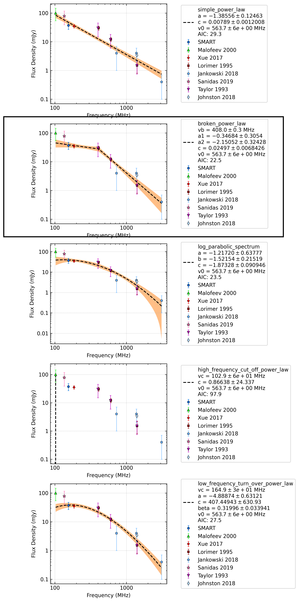

.. _J0823+0159:
J0823+0159
==========

Best Fit
--------
.. image:: best_fits/J0823+0159_broken_power_law_fit.png
  :width: 800

.. csv-table:: J0823+0159 fit results
   :header: "model","vb (MHz)","a1","a2","b","v0 (MHz)"

   "broken_power_law","407±6","-0.31±0.30","-2.31±0.38","0.03±0.01","563±5"

Fit Before MWA
--------------
.. image:: before_mwa/J0823+0159_broken_power_law_fit.png
  :width: 800

.. csv-table:: J0823+0159 before fit results
   :header: "model","vb (MHz)","a1","a2","b","v0 (MHz)"

   "broken_power_law","407±0","-0.31±0.31","-2.31±0.38","0.03±0.01","563±5"

Flux Density Results
--------------------
.. csv-table:: J0823+0159 flux density total results
   :header: "N obs", "Flux Density (mJy)", "u_S_mean", "u_scint", "m_r_v"

   "1",  "37.2±23.6", "10.3", "21.3", "0.572"

.. csv-table:: J0823+0159 flux density individual results
   :header: "ObsID", "Flux Density (mJy)"

    "1266155952", "37.2±10.3"

Comparison Fit
--------------

Detection Plots
---------------

.. image:: detection_plots/pf_1266155952_J0823+0159_08:23:09.76_+01:59:12.46_b1024_PSR_J0823+0159.pfd.png
  :width: 800

.. image:: on_pulse_plots/1266155952_J0823+0159_100_bins_gaussian_components.png
  :width: 800