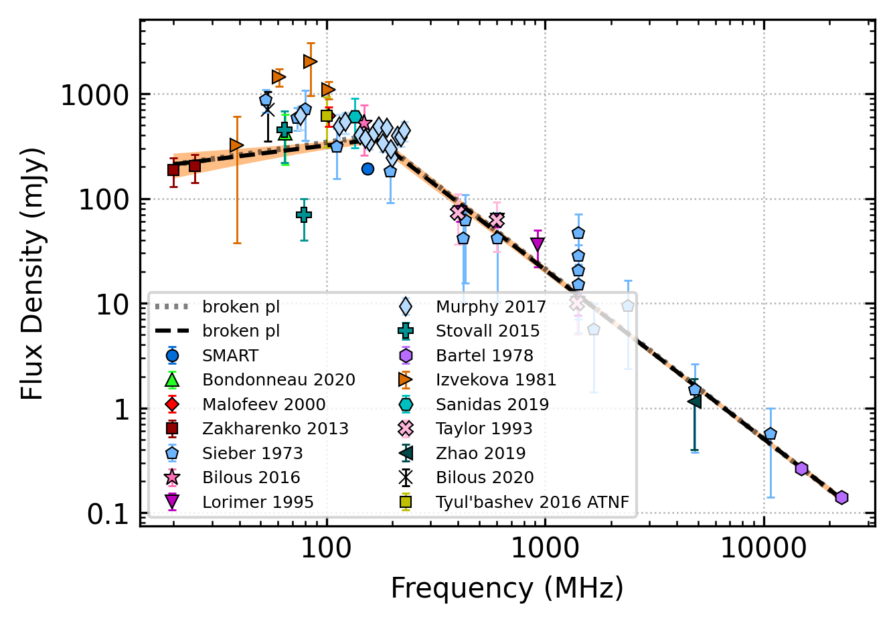

.. _J0826+2637:
J0826+2637
==========

Best Fit
--------

.. csv-table:: J0826+2637 fit results
   :header: "model","vb (MHz)","a1","a2","b","v0 (MHz)"

   "broken_power_law","165±12","0.29±0.14","-1.62±0.03","0.59±0.15","673±6"

Fit Before MWA
--------------

.. csv-table:: J0826+2637 before fit results
   :header: "model","vb (MHz)","a1","a2","b","v0 (MHz)"

   "broken_power_law","164±12","0.30±0.14","-1.62±0.03","0.61±0.16","673±6"

Flux Density Results
--------------------
.. csv-table:: J0826+2637 flux density total results
   :header: "N obs", "Flux Density (mJy)", "u_S_mean", "u_scint", "m_r_v"

   "1",  "193.9±123.1", "18.8", "121.7", "0.628"

.. csv-table:: J0826+2637 flux density individual results
   :header: "ObsID", "Flux Density (mJy)"

    "1265725128", "193.9±18.8"

Comparison Fit
--------------
.. image:: comparison_fits/J0826+2637_comparison_fit.png
  :width: 800

Detection Plots
---------------

.. image:: detection_plots/1265725128_J0826+2637.prepfold.png
  :width: 800

.. image:: on_pulse_plots/1265725128_J0826+2637_1024_bins_gaussian_components.png
  :width: 800