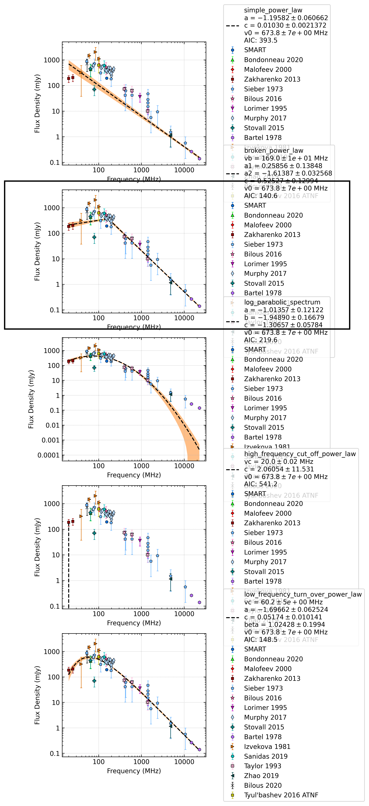

.. _J0826+2637:
J0826+2637
==========

Best Fit
--------
.. image:: best_fits/J0826+2637_broken_power_law_fit.png
  :width: 800

.. csv-table:: J0826+2637 fit results
   :header: "model","vb (MHz)","a1","a2","b"

   "broken_power_law","161±9","0.29±0.11","-1.61±0.02","0.71±0.19"

Fit Before MWA
--------------
.. image:: before_mwa/J0826+2637_broken_power_law_fit.png
  :width: 800

.. csv-table:: J0826+2637 before fit results
   :header: "model","vb (MHz)","a1","a2","b"

   "broken_power_law","160±9","0.30±0.11","-1.61±0.02","0.73±0.20"

Flux Density Results
--------------------
.. csv-table:: J0826+2637 flux density total results
   :header: "N obs", "Flux Density (mJy)", "u_S_mean", "u_scint", "m_r_v"

   "1",  "174.4±110.8", "16.9", "109.5", "0.628"

.. csv-table:: J0826+2637 flux density individual results
   :header: "ObsID", "Flux Density (mJy)"

    "1265725128", "174.4±16.9"

Comparison Fit
--------------

Detection Plots
---------------

.. image:: on_pulse_plots/1265725128_J0826+2637_1024_bins_gaussian_components.png
  :width: 800