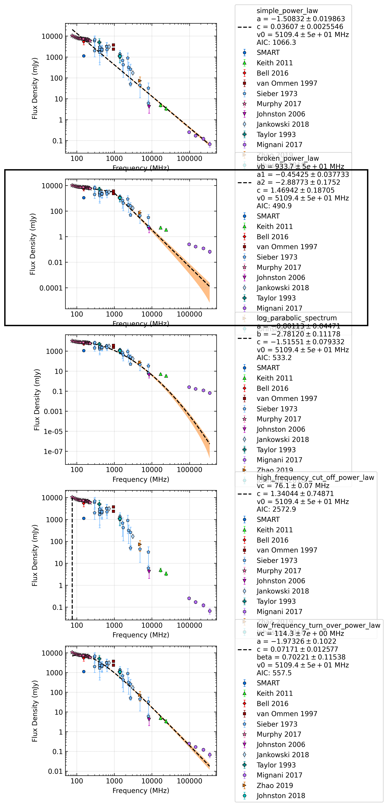

.. _J0835-4510:
J0835-4510
==========

Best Fit
--------
.. image:: best_fits/J0835-4510_low_frequency_turn_over_power_law_fit.png
  :width: 800

.. csv-table:: J0835-4510 fit results
   :header: "model","vc (MHz)","a","b","beta"

   "low_frequency_turn_over_power_law","112±3","-2.76±0.03","1.57±0.12","0.54±0.01"

Fit Before MWA
--------------
.. image:: before_mwa/J0835-4510_low_frequency_turn_over_power_law_fit.png
  :width: 800

.. csv-table:: J0835-4510 before fit results
   :header: "model","vc (MHz)","a","b","beta"

   "low_frequency_turn_over_power_law","112±3","-2.76±0.03","1.56±0.12","0.54±0.01"

Flux Density Results
--------------------
.. csv-table:: J0835-4510 flux density total results
   :header: "N obs", "Flux Density (mJy)", "u_S_mean", "u_scint", "m_r_v"

   "1",  "985.2±347.5", "48.7", "344.0", "0.349"

.. csv-table:: J0835-4510 flux density individual results
   :header: "ObsID", "Flux Density (mJy)"

    "1265983624", "0.0±6.3"
    "1265470568", "-0.0±-6.4"
    "1266680784", "985.2±48.7"

Comparison Fit
--------------

Detection Plots
---------------

.. image:: detection_plots/1265983624_J0835-4510.prepfold.png
  :width: 800

.. image:: on_pulse_plots/1265983624_J0835-4510_894_bins_gaussian_components.png
  :width: 800
.. image:: detection_plots/1265470568_J0835-4510.prepfold.png
  :width: 800

.. image:: on_pulse_plots/1265470568_J0835-4510_100_bins_gaussian_components.png
  :width: 800

.. image:: on_pulse_plots/1266680784_J0835-4510_894_bins_gaussian_components.png
  :width: 800