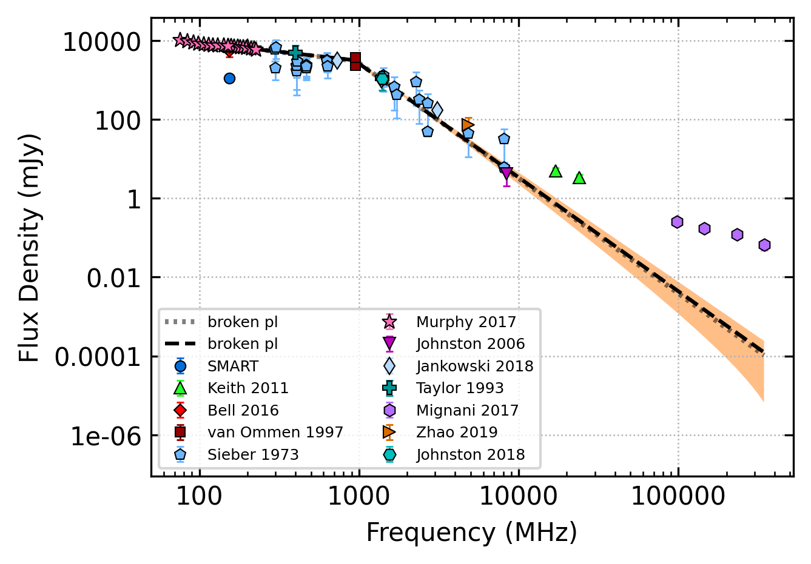

.. _J0835-4510:
J0835-4510
==========

Best Fit
--------

.. csv-table:: J0835-4510 fit results
   :header: "model","vc (MHz)","a","b","beta","v0 (MHz)"

   "low_frequency_turn_over_power_law","115±9","-2.68±0.27","0.09±0.06","0.59±0.16","3376±33"

Fit Before MWA
--------------

.. csv-table:: J0835-4510 before fit results
   :header: "model","vc (MHz)","a","b","beta","v0 (MHz)"

   "low_frequency_turn_over_power_law","115±9","-2.67±0.28","0.09±0.06","0.59±0.17","3376±33"

Flux Density Results
--------------------
.. csv-table:: J0835-4510 flux density total results
   :header: "N obs", "Flux Density (mJy)", "u_S_mean", "u_scint", "m_r_v"

   "1",  "1120.6±395.2", "55.3", "391.4", "0.349"

.. csv-table:: J0835-4510 flux density individual results
   :header: "ObsID", "Flux Density (mJy)"

    "1265983624", "0.0±7.0"
    "1265470568", "-0.0±-7.1"
    "1266680784", "1120.6±55.3"

Comparison Fit
--------------
.. image:: comparison_fits/J0835-4510_comparison_fit.png
  :width: 800

Detection Plots
---------------

.. image:: on_pulse_plots/1265983624_J0835-4510_894_bins_gaussian_components.png
  :width: 800

.. image:: on_pulse_plots/1265470568_J0835-4510_100_bins_gaussian_components.png
  :width: 800
.. image:: detection_plots/1266680784_J0835-4510.prepfold.png
  :width: 800

.. image:: on_pulse_plots/1266680784_J0835-4510_894_bins_gaussian_components.png
  :width: 800