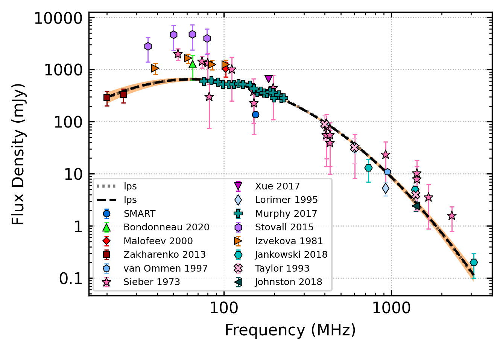

.. _J0837+0610:
J0837+0610
==========

Best Fit
--------

.. csv-table:: J0837+0610 fit results
   :header: "model","vc (MHz)","vpeak (MHz)","a","beta","c","v0 (MHz)"

   "double_turn_over_spectrum","4229±1769","77±3","-8.00±0.13","0.18±0.00","922714933488966.88±323628464770898.69","248±2"

Fit Before MWA
--------------

.. csv-table:: J0837+0610 before fit results
   :header: "model","vc (MHz)","vpeak (MHz)","a","beta","c","v0 (MHz)"

   "double_turn_over_spectrum","13855±33134","69±1","-8.00±4.02","0.18±0.00","807345457258270.00±99082033949159.12","248±2"

Flux Density Results
--------------------
.. csv-table:: J0837+0610 flux density total results
   :header: "N obs", "Flux Density (mJy)", "u_S_mean", "u_scint", "m_r_v"

   "1",  "138.3±106.9", "17.3", "105.5", "0.763"

.. csv-table:: J0837+0610 flux density individual results
   :header: "ObsID", "Flux Density (mJy)"

    "1265725128", "138.3±17.3"

Comparison Fit
--------------
.. image:: comparison_fits/J0837+0610_comparison_fit.png
  :width: 800

Detection Plots
---------------

.. image:: detection_plots/1265725128_J0837+0610.prepfold.png
  :width: 800

.. image:: on_pulse_plots/1265725128_J0837+0610_1024_bins_gaussian_components.png
  :width: 800