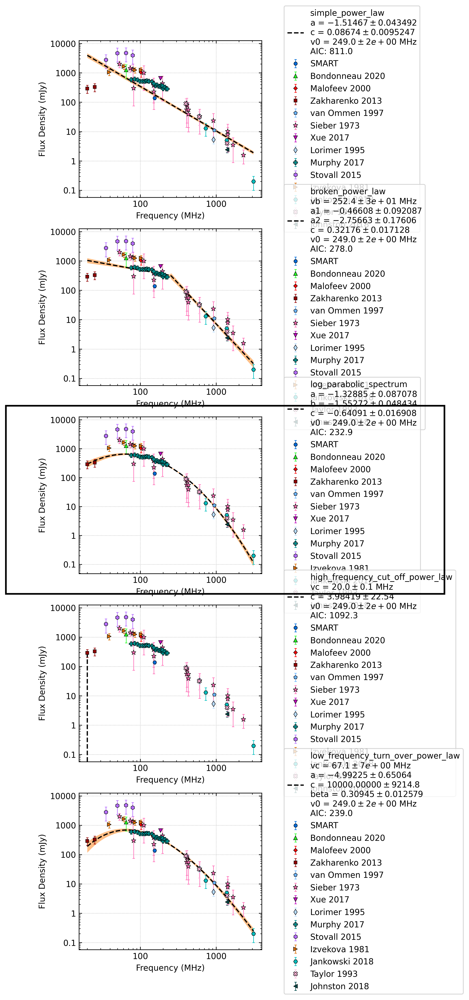

.. _J0837+0610:
J0837+0610
==========

Best Fit
--------
.. image:: best_fits/J0837+0610_log_parabolic_spectrum_fit.png
  :width: 800

.. csv-table:: J0837+0610 fit results
   :header: "model","a","b","c"

   "log_parabolic_spectrum","-1.35±0.10","-3.53±0.18","-2.49±0.09"

Fit Before MWA
--------------
.. image:: before_mwa/J0837+0610_log_parabolic_spectrum_fit.png
  :width: 800

.. csv-table:: J0837+0610 before fit results
   :header: "model","a","b","c"

   "log_parabolic_spectrum","-1.35±0.10","-3.53±0.18","-2.49±0.09"

Flux Density Results
--------------------
.. csv-table:: J0837+0610 flux density total results
   :header: "N obs", "Flux Density (mJy)", "u_S_mean", "u_scint", "m_r_v"

   "1",  "124.4±96.2", "15.6", "94.9", "0.763"

.. csv-table:: J0837+0610 flux density individual results
   :header: "ObsID", "Flux Density (mJy)"

    "1265725128", "124.4±15.6"

Comparison Fit
--------------

Detection Plots
---------------

.. image:: on_pulse_plots/1265725128_J0837+0610_1024_bins_gaussian_components.png
  :width: 800