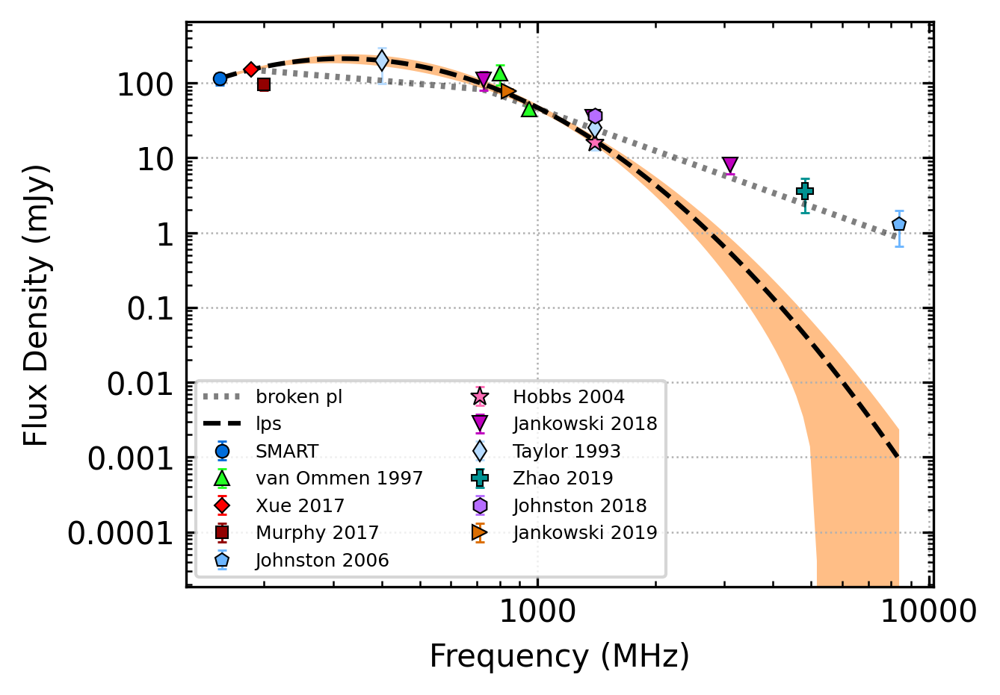
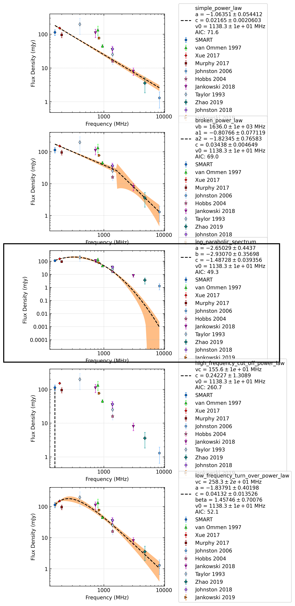
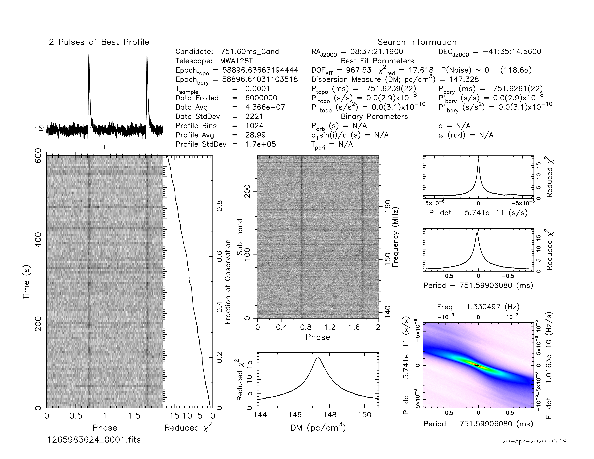
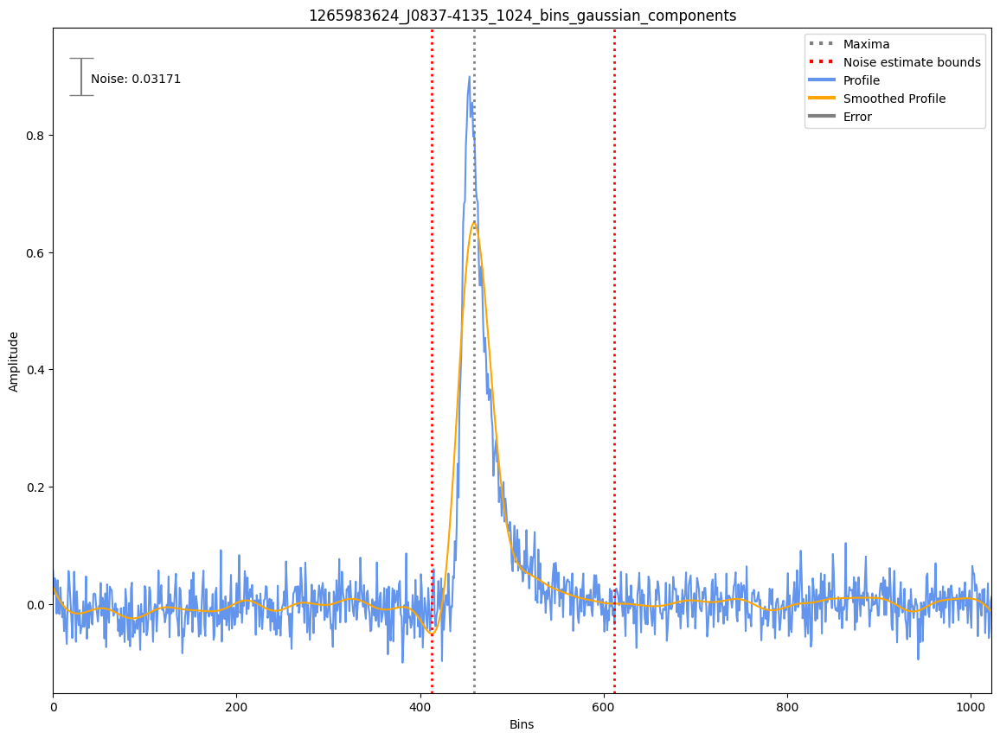
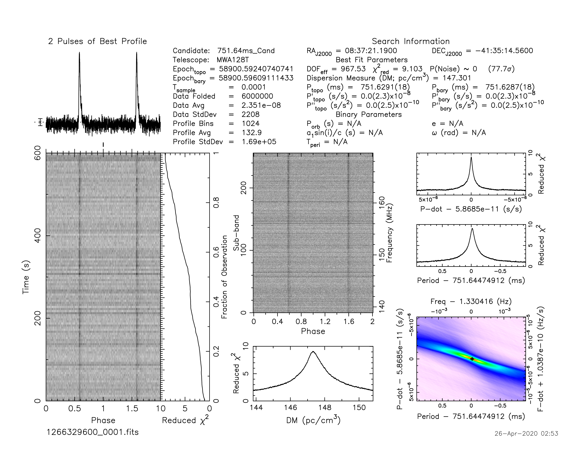
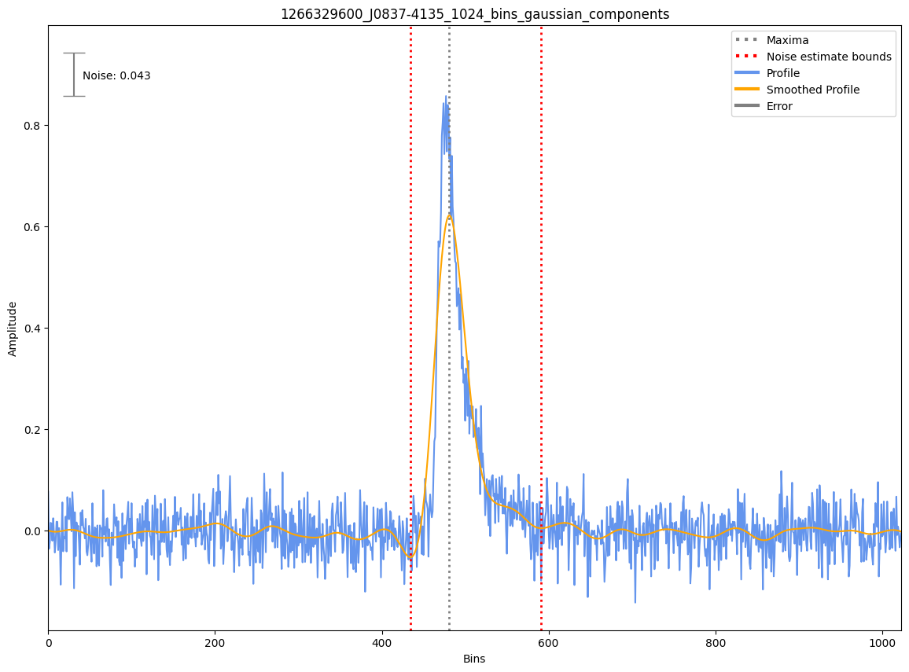

.. _J0837-4135:
J0837-4135
==========

Best Fit
--------

.. csv-table:: J0837-4135 fit results
   :header: "model","a","b","c","v0 (MHz)"

   "log_parabolic_spectrum","-2.65±0.46","-2.93±0.37","-1.49±0.04","1138±11"

Fit Before MWA
--------------

.. csv-table:: J0837-4135 before fit results
   :header: "model","vb (MHz)","a1","a2","b","v0 (MHz)"

   "broken_power_law","727±5","-0.44±0.14","-1.87±0.39","0.06±0.02","1246±12"

Flux Density Results
--------------------
.. csv-table:: J0837-4135 flux density total results
   :header: "N obs", "Flux Density (mJy)", "u_S_mean", "u_scint", "m_r_v"

   "4",  "113.3±42.5", "21.1", "27.5", "0.243"

.. csv-table:: J0837-4135 flux density individual results
   :header: "ObsID", "Flux Density (mJy)"

    "1265983624", "174.8±14.3"
    "1266329600", "144.2±12.1"
    "1265470568", "80.3±7.8"
    "1266680784", "53.8±6.1"

Comparison Fit
--------------

Detection Plots
---------------

.. image:: detection_plots/1265470568_J0837-4135.prepfold.png
  :width: 800

.. image:: on_pulse_plots/1265470568_J0837-4135_1024_bins_gaussian_components.png
  :width: 800
.. image:: detection_plots/1266680784_J0837-4135.prepfold.png
  :width: 800

.. image:: on_pulse_plots/1266680784_J0837-4135_1024_bins_gaussian_components.png
  :width: 800