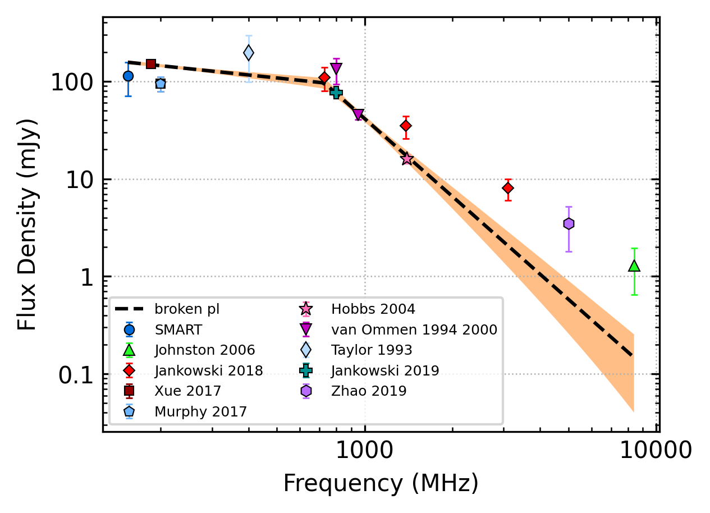
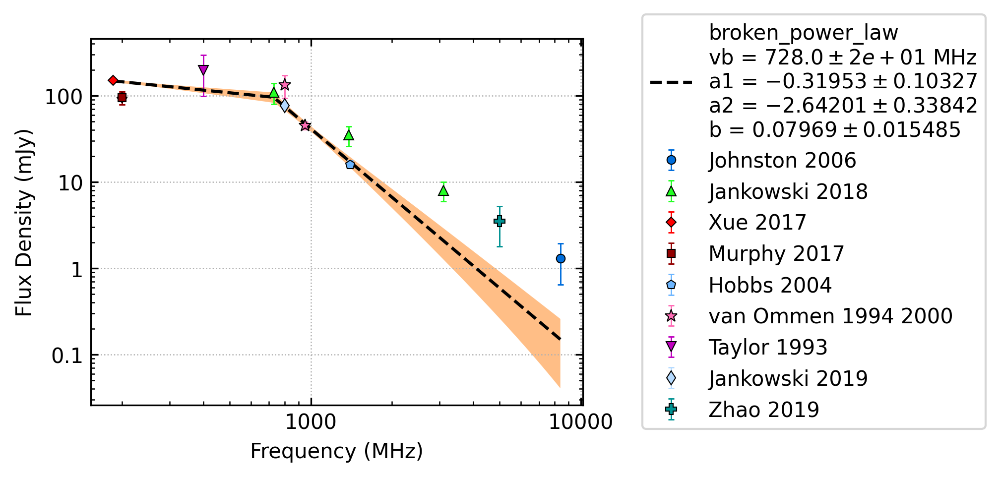

.. _J0837-4135:
J0837-4135
==========

Best Fit
--------

.. csv-table:: J0837-4135 fit results
   :header: "model","vb (MHz)","a1","a2","b"

   "broken_power_law","535±124","0.83±0.83","-2.72±0.25","0.47±0.64"

Fit Before MWA
--------------

.. csv-table:: J0837-4135 before fit results
   :header: "model","vb (MHz)","a1","a2","b"

   "broken_power_law","510±91","1.05±0.74","-2.72±0.25","0.68±0.83"

Flux Density Results
--------------------
.. csv-table:: J0837-4135 flux density total results
   :header: "N obs", "Flux Density (mJy)", "u_S_mean", "u_scint", "m_r_v"

   "4",  "101.6±38.6", "19.0", "24.6", "0.243"

.. csv-table:: J0837-4135 flux density individual results
   :header: "ObsID", "Flux Density (mJy)"

    "1265983624", "157.1±12.8"
    "1266329600", "130.2±10.9"
    "1265470568", "71.9±7.0"
    "1266680784", "47.3±5.4"

Comparison Fit
--------------
.. image:: comparison_fits/J0837-4135_comparison_fit.png
  :width: 800

Detection Plots
---------------

.. image:: detection_plots/1265983624_J0837-4135.prepfold.png
  :width: 800

.. image:: on_pulse_plots/1265983624_J0837-4135_1024_bins_gaussian_components.png
  :width: 800
.. image:: detection_plots/1266329600_J0837-4135.prepfold.png
  :width: 800

.. image:: on_pulse_plots/1266329600_J0837-4135_1024_bins_gaussian_components.png
  :width: 800
.. image:: detection_plots/1265470568_J0837-4135.prepfold.png
  :width: 800

.. image:: on_pulse_plots/1265470568_J0837-4135_1024_bins_gaussian_components.png
  :width: 800
.. image:: detection_plots/1266680784_J0837-4135.prepfold.png
  :width: 800

.. image:: on_pulse_plots/1266680784_J0837-4135_1024_bins_gaussian_components.png
  :width: 800