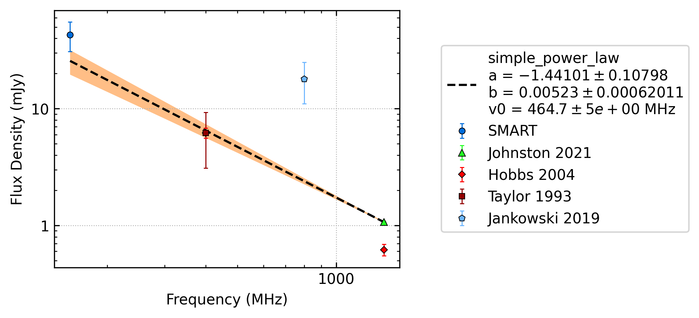
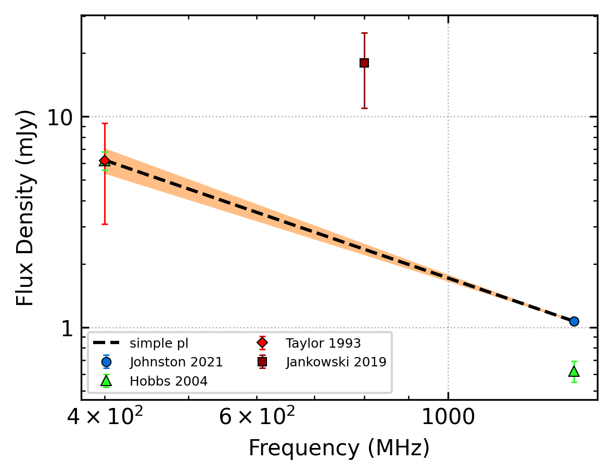
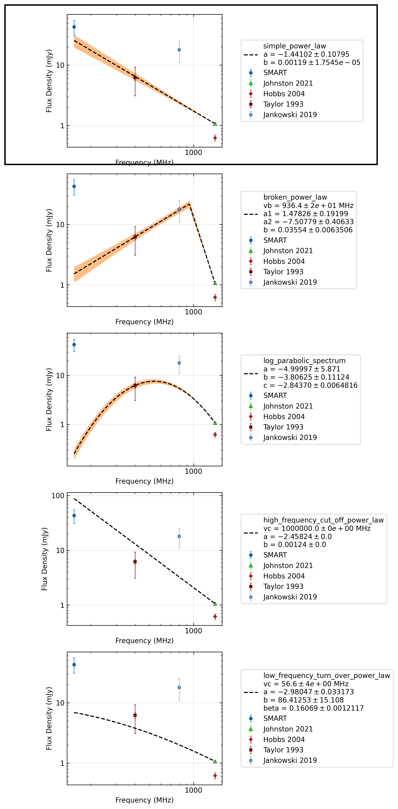
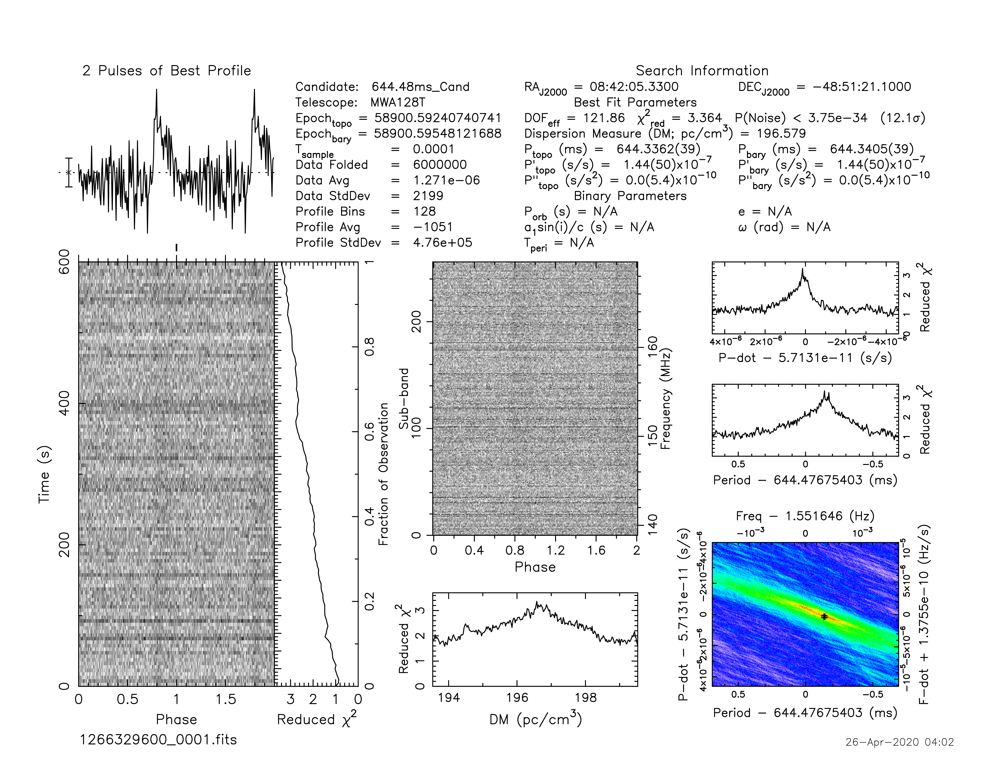

.. _J0842-4851:
J0842-4851
==========

Best Fit
--------

.. csv-table:: J0842-4851 fit results
   :header: "model","a","b"

   "simple_power_law","-1.85±0.11","0.00±0.00"

Fit Before MWA
--------------

.. csv-table:: J0842-4851 before fit results
   :header: "model","a","b"

   "simple_power_law","-1.84±0.12","0.00±0.00"

Flux Density Results
--------------------
.. csv-table:: J0842-4851 flux density total results
   :header: "N obs", "Flux Density (mJy)", "u_S_mean", "u_scint", "m_r_v"

   "1",  "38.8±11.0", "7.4", "8.2", "0.212"

.. csv-table:: J0842-4851 flux density individual results
   :header: "ObsID", "Flux Density (mJy)"

    "1266329600", "38.8±7.4"

Comparison Fit
--------------

Detection Plots
---------------

.. image:: on_pulse_plots/1266329600_J0842-4851_128_bins_gaussian_components.png
  :width: 800