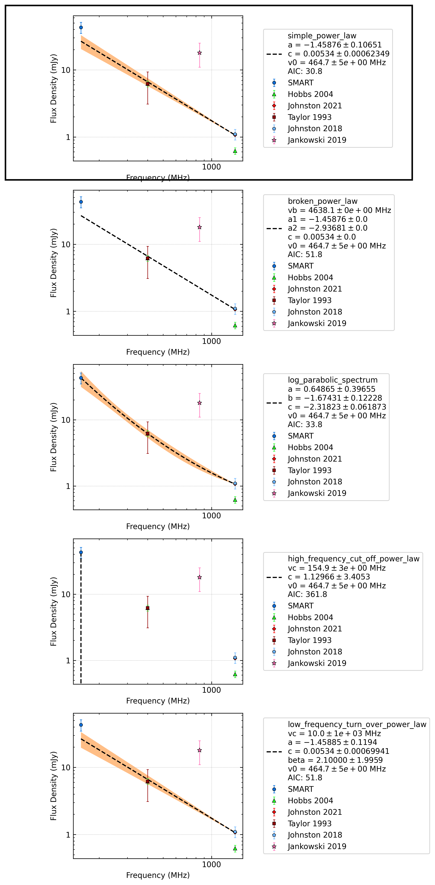

.. _J0842-4851:
J0842-4851
==========

Best Fit
--------
.. image:: best_fits/J0842-4851_i_fit.png
  :width: 800

.. csv-table:: J0842-4851 fit results
   :header: "model","a","b","v0 (MHz)"

   "i","-1.44±0.11","0.01±0.00","464±4"

Fit Before MWA
--------------

.. csv-table:: J0842-4851 before fit results
   :header: "model","a","b","v0 (MHz)"

   "i","-1.41±0.11","0.00±0.00","748±7"

Flux Density Results
--------------------
.. csv-table:: J0842-4851 flux density total results
   :header: "N obs", "Flux Density (mJy)", "u_S_mean", "u_scint", "m_r_v"

   "1",  "43.0±12.2", "8.2", "9.1", "0.212"

.. csv-table:: J0842-4851 flux density individual results
   :header: "ObsID", "Flux Density (mJy)"

    "1266329600", "43.0±8.2"

Comparison Fit
--------------

Detection Plots
---------------

.. image:: on_pulse_plots/1266329600_J0842-4851_128_bins_gaussian_components.png
  :width: 800