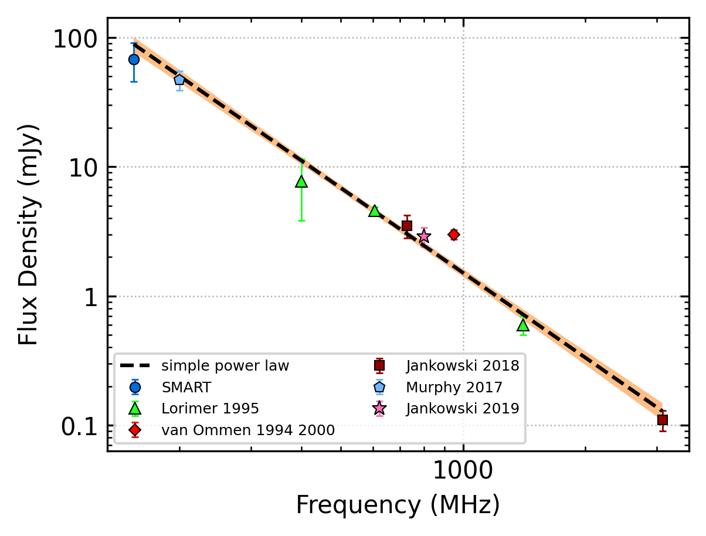
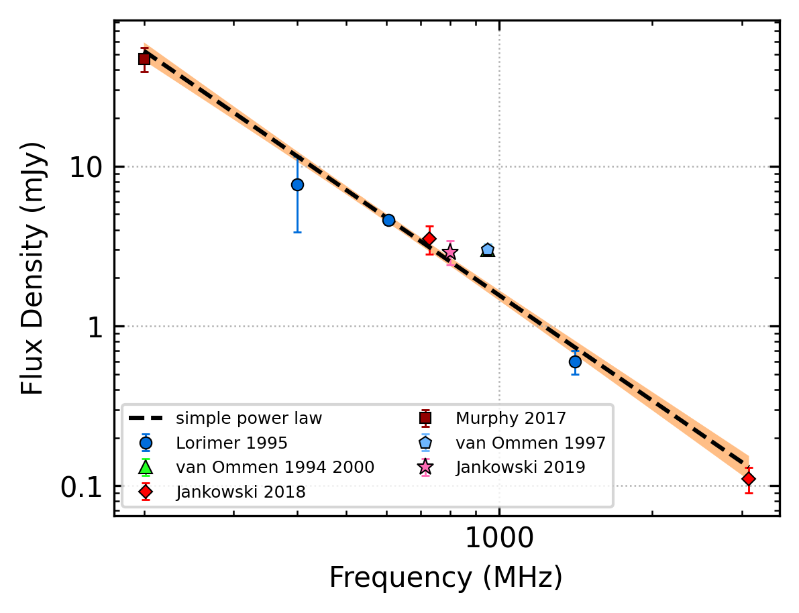
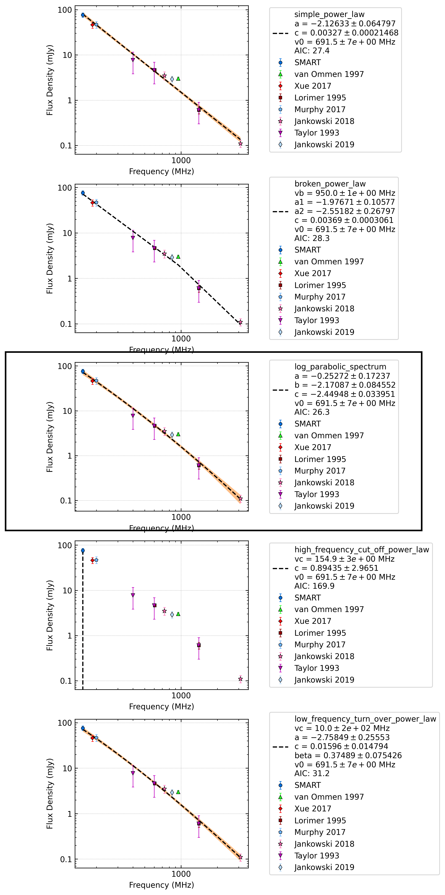
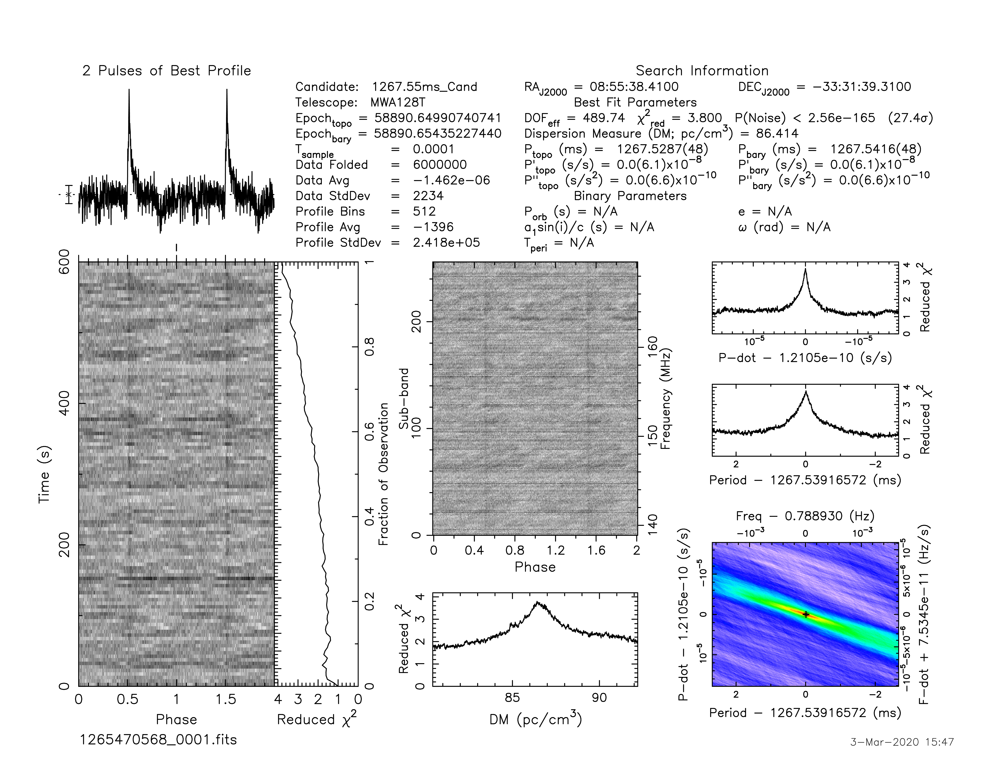

J0855-3331
==========

Best Fit
--------

.. csv-table:: J0855-3331 fit results
   :header: "model","a","b"

   "simple_power_law","-2.18±0.09","0.00±0.00"

Fit Before MWA
--------------

.. csv-table:: J0855-3331 before fit results
   :header: "model","a","b"

   "simple_power_law","-2.21±0.09","0.00±0.00"

Flux Density Results
--------------------
.. csv-table:: J0855-3331 flux density total results
   :header: "N obs", "Flux Density (mJy)", " u_S_mean", "u_scint", "m_r_v"

   "1",  "68.3±22.6", "7.6", "21.3", "0.311"

.. csv-table:: J0855-3331 flux density individual results
   :header: "ObsID", "Flux Density (mJy)"

    "1265470568", "68.3±7.6"

Comparison Fit
--------------

Detection Plots
---------------

.. image:: on_pulse_plots/1265470568_J0855-3331_512_bins_gaussian_components.png
  :width: 800