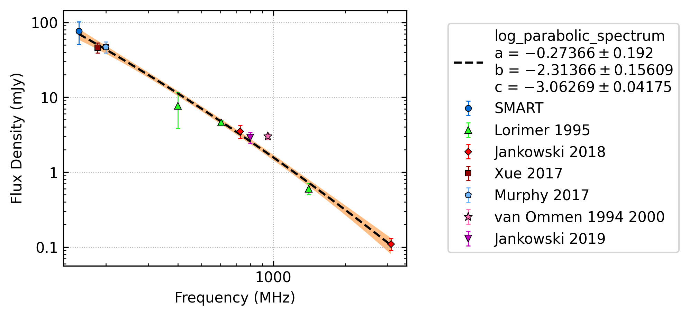
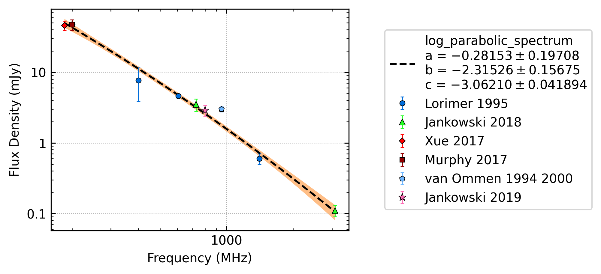

.. _J0855-3331:
J0855-3331
==========

Best Fit
--------

.. csv-table:: J0855-3331 fit results
   :header: "model","a","b","c"

   "log_parabolic_spectrum","-0.27±0.19","-2.31±0.16","-3.06±0.04"

Fit Before MWA
--------------

.. csv-table:: J0855-3331 before fit results
   :header: "model","a","b","c"

   "log_parabolic_spectrum","-0.28±0.20","-2.32±0.16","-3.06±0.04"

Flux Density Results
--------------------
.. csv-table:: J0855-3331 flux density total results
   :header: "N obs", "Flux Density (mJy)", "u_S_mean", "u_scint", "m_r_v"

   "1",  "76.3±25.2", "8.5", "23.7", "0.311"

.. csv-table:: J0855-3331 flux density individual results
   :header: "ObsID", "Flux Density (mJy)"

    "1265470568", "76.3±8.5"

Comparison Fit
--------------
.. image:: comparison_fits/J0855-3331_comparison_fit.png
  :width: 800

Detection Plots
---------------

.. image:: detection_plots/1265470568_J0855-3331.prepfold.png
  :width: 800

.. image:: on_pulse_plots/1265470568_J0855-3331_512_bins_gaussian_components.png
  :width: 800