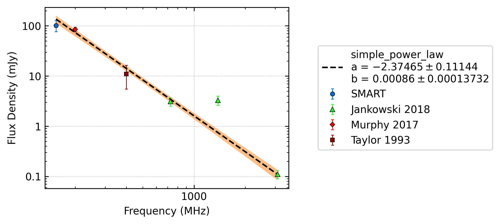
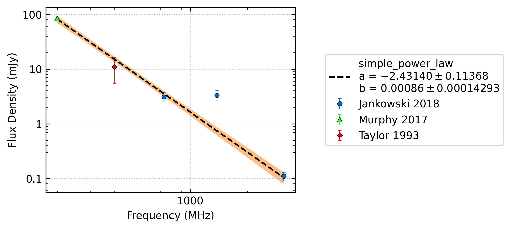
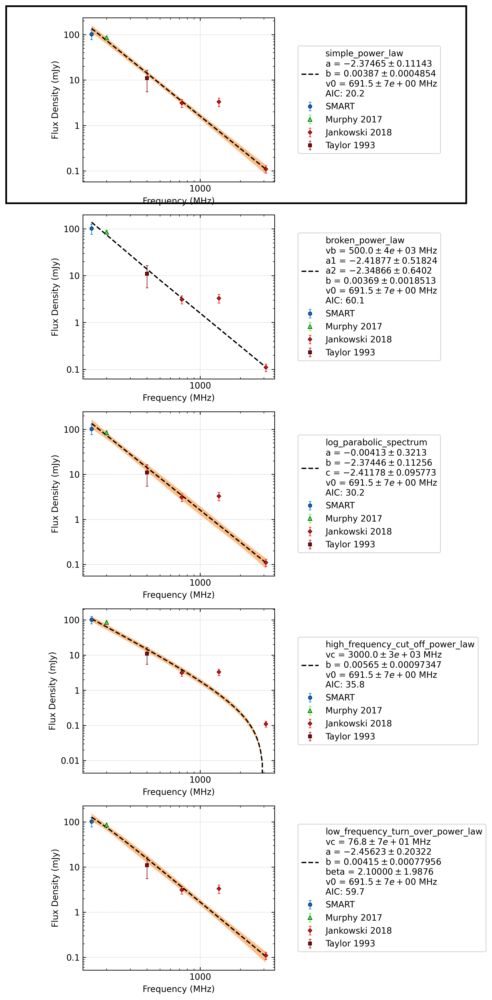
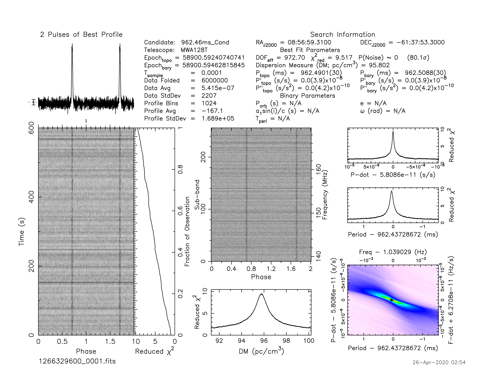
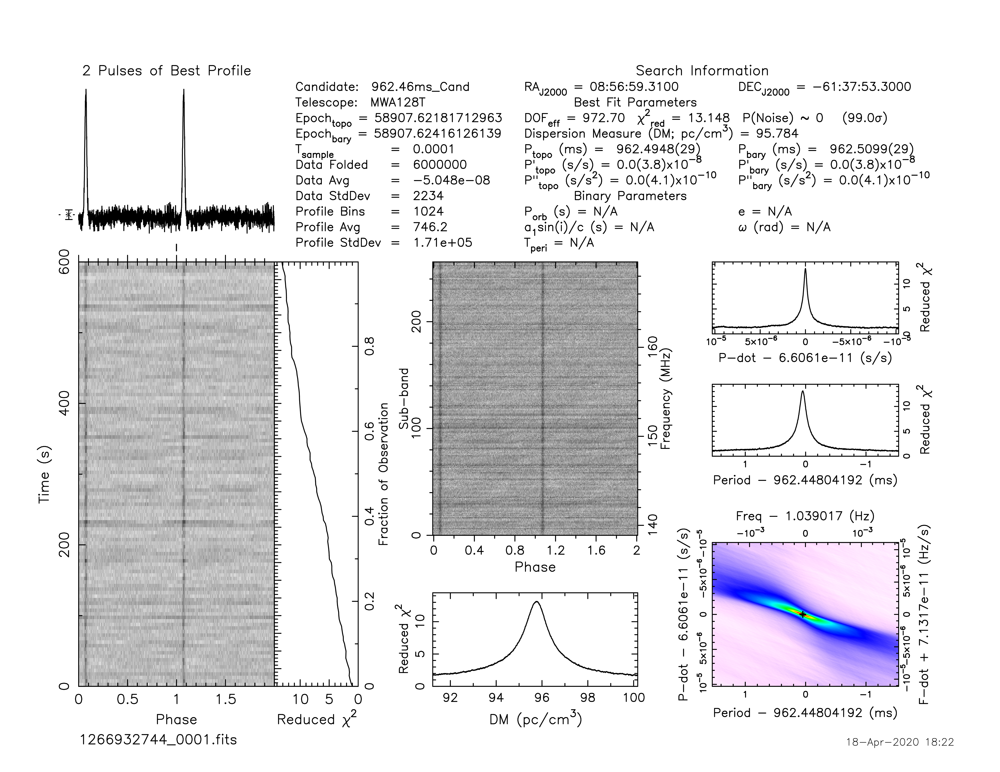

J0856-6137
==========

Best Fit
--------

.. csv-table:: J0856-6137 fit results
   :header: "model","a","b"

   "simple_power_law","-2.35±0.11","0.00±0.00"

Fit Before MWA
--------------

.. csv-table:: J0856-6137 before fit results
   :header: "model","a","b"

   "simple_power_law","-2.43±0.09","0.00±0.00"

Flux Density Results
--------------------
.. csv-table:: J0856-6137 flux density total results
   :header: "N obs", "Flux Density (mJy)", " u_S_mean", "u_scint", "m_r_v"

   "2",  "89.9±22.3", "12.8", "26.8", "0.298"

.. csv-table:: J0856-6137 flux density individual results
   :header: "ObsID", "Flux Density (mJy)"

    "1266329600", "100.3±10.0"
    "1266932744", "79.5±8.0"

Comparison Fit
--------------

Detection Plots
---------------

.. image:: on_pulse_plots/1266329600_J0856-6137_1024_bins_gaussian_components.png
  :width: 800

.. image:: on_pulse_plots/1266932744_J0856-6137_1024_bins_gaussian_components.png
  :width: 800