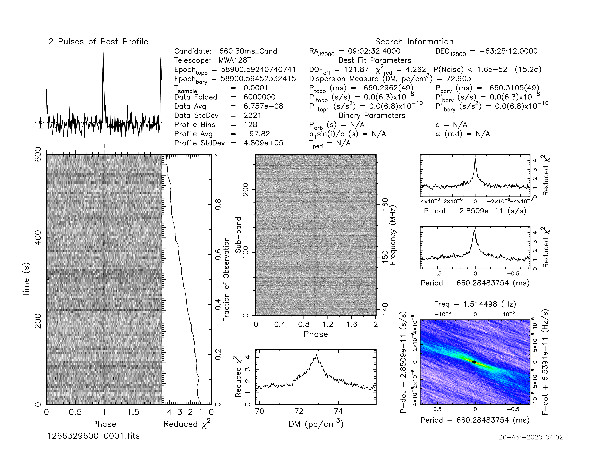
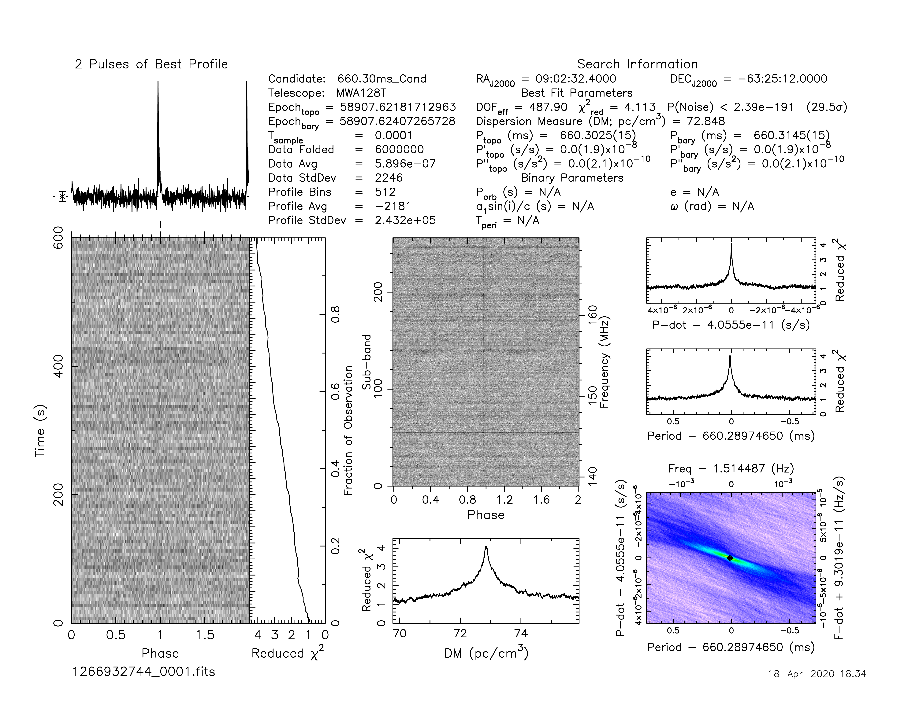
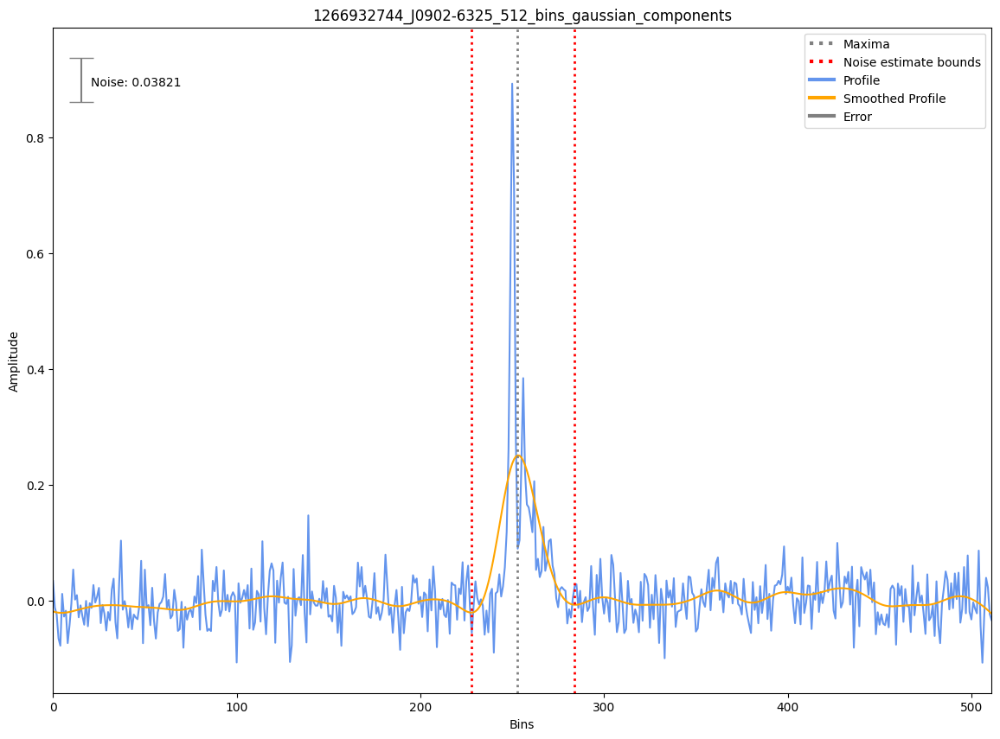

J0902-6325
==========

Best Fit
--------
Only 2 MWA data and 2 cat data available

Flux Density Results
--------------------
.. csv-table:: J0902-6325 flux density total results
   :header: "N obs", "Flux Density (mJy)", "u_S_mean", "u_scint", "m_r_v"

   "2",  "27.2±12.5", "9.8", "9.2", "0.338"

.. csv-table:: J0902-6325 flux density individual results
   :header: "ObsID", "Flux Density (mJy)"

    "1266329600", "35.0±8.8"
    "1266932744", "19.5±4.4"

Detection Plots
---------------

.. image:: on_pulse_plots/1266329600_J0902-6325_128_bins_gaussian_components.png
  :width: 800

