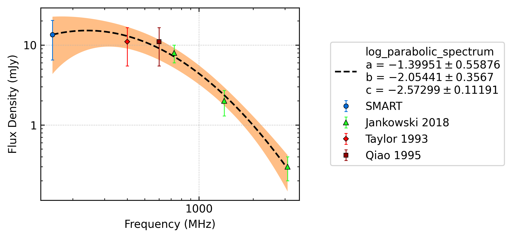
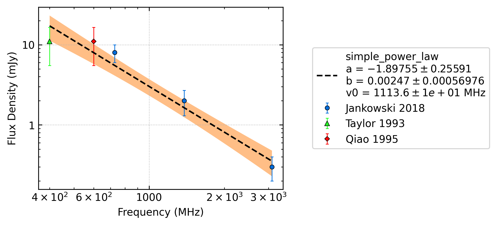

.. _J0904-7459:
J0904-7459
==========

Best Fit
--------

.. csv-table:: J0904-7459 fit results
   :header: "model","a","b","c"

   "log_parabolic_spectrum","-1.48±0.41","-2.05±0.27","-2.56±0.09"

Fit Before MWA
--------------

.. csv-table:: J0904-7459 before fit results
   :header: "model","a","b"

   "simple_power_law","-1.92±0.26","0.00±0.00"

Flux Density Results
--------------------
.. csv-table:: J0904-7459 flux density total results
   :header: "N obs", "Flux Density (mJy)", "u_S_mean", "u_scint", "m_r_v"

   "1",  "11.5±5.9", "3.7", "4.6", "0.399"

.. csv-table:: J0904-7459 flux density individual results
   :header: "ObsID", "Flux Density (mJy)"

    "1266932744", "11.5±3.7"

Comparison Fit
--------------
.. image:: comparison_fits/J0904-7459_comparison_fit.png
  :width: 800

Detection Plots
---------------

.. image:: detection_plots/1266932744_J0904-7459.prepfold.png
  :width: 800

.. image:: on_pulse_plots/1266932744_J0904-7459_128_bins_gaussian_components.png
  :width: 800