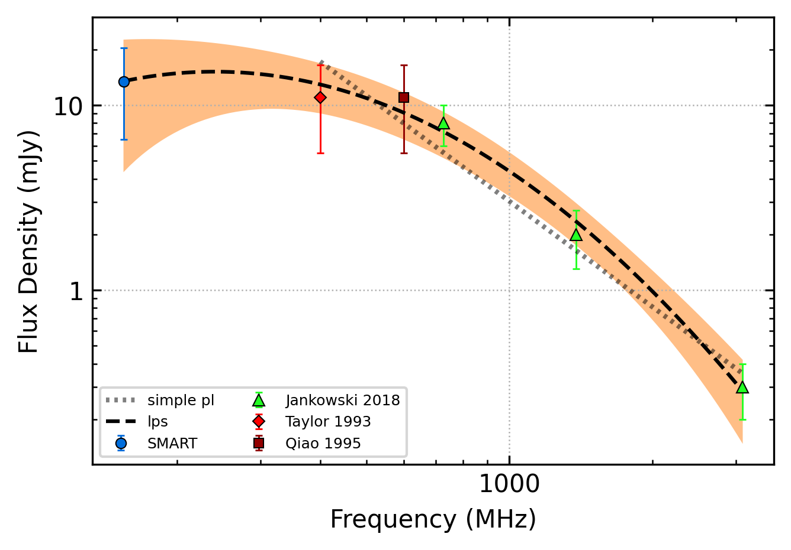
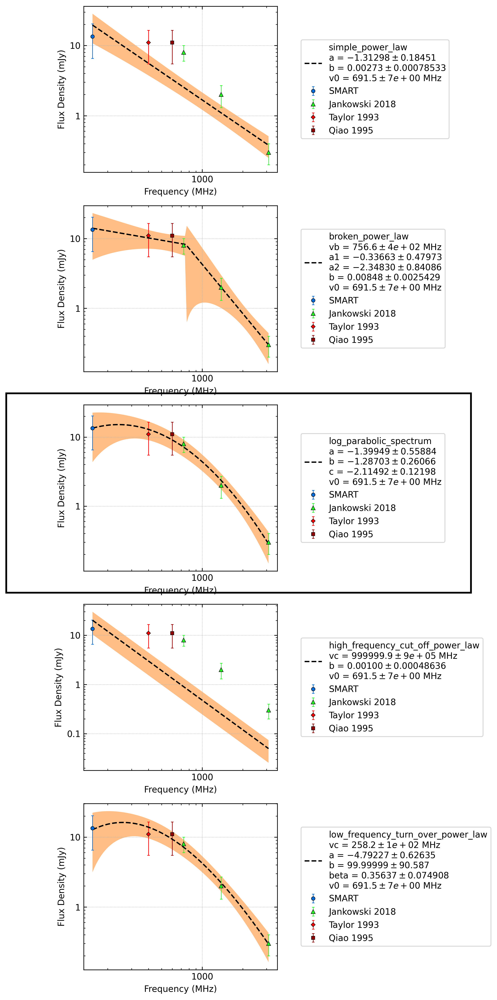
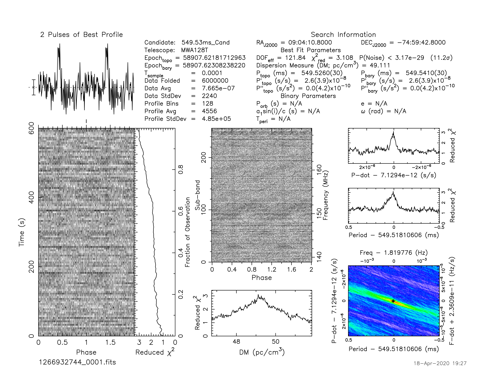
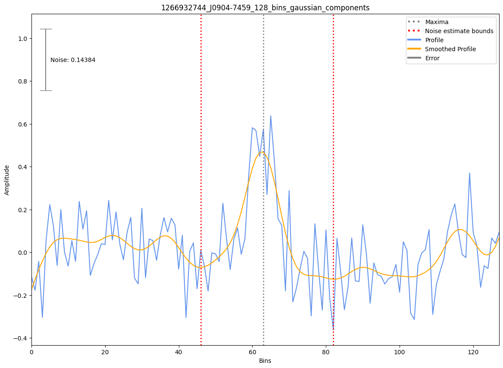

.. _J0904-7459:
J0904-7459
==========

Best Fit
--------

.. csv-table:: J0904-7459 fit results
   :header: "model","a","c","v0 (MHz)"

   "log_parabolic_spectrum","-1.36±0.67","-1.42±0.25","-2.19±0.13","691±6"

Fit Before MWA
--------------

.. csv-table:: J0904-7459 before fit results
   :header: "model","a","c","v0 (MHz)"

   "simple_power_law","-1.93±0.26","0.00±0.00","1113±11"

Flux Density Results
--------------------
.. csv-table:: J0904-7459 flux density total results
   :header: "N obs", "Flux Density (mJy)", "u_S_mean", "u_scint", "m_r_v"

   "1",  "13.4±6.9", "4.4", "5.4", "0.399"

.. csv-table:: J0904-7459 flux density individual results
   :header: "ObsID", "Flux Density (mJy)"

    "1266932744", "13.4±4.4"

Comparison Fit
--------------

Detection Plots
---------------

