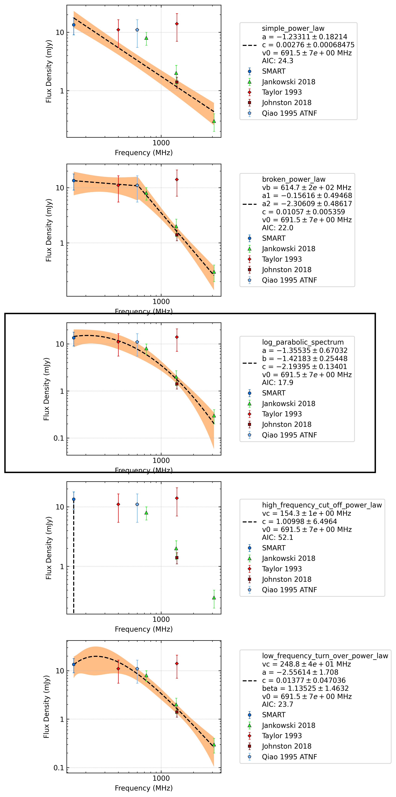

.. _J0904-7459:
J0904-7459
==========

Best Fit
--------
.. image:: best_fits/J0904-7459_o_fit.png
  :width: 800

.. csv-table:: J0904-7459 fit results
   :header: "model","a","b","c","v0 (MHz)"

   "o","-1.40±0.56","-1.29±0.26","-2.11±0.12","691±6"

Fit Before MWA
--------------

.. csv-table:: J0904-7459 before fit results
   :header: "model","a","b","v0 (MHz)"

   "i","-1.90±0.26","0.00±0.00","1113±11"

Flux Density Results
--------------------
.. csv-table:: J0904-7459 flux density total results
   :header: "N obs", "Flux Density (mJy)", "u_S_mean", "u_scint", "m_r_v"

   "1",  "13.4±6.9", "4.4", "5.4", "0.399"

.. csv-table:: J0904-7459 flux density individual results
   :header: "ObsID", "Flux Density (mJy)"

    "1266932744", "13.4±4.4"

Comparison Fit
--------------

Detection Plots
---------------

.. image:: detection_plots/1266932744_J0904-7459.prepfold.png
  :width: 800

.. image:: on_pulse_plots/1266932744_J0904-7459_128_bins_gaussian_components.png
  :width: 800