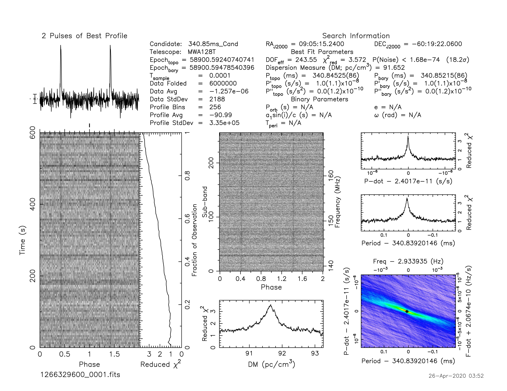
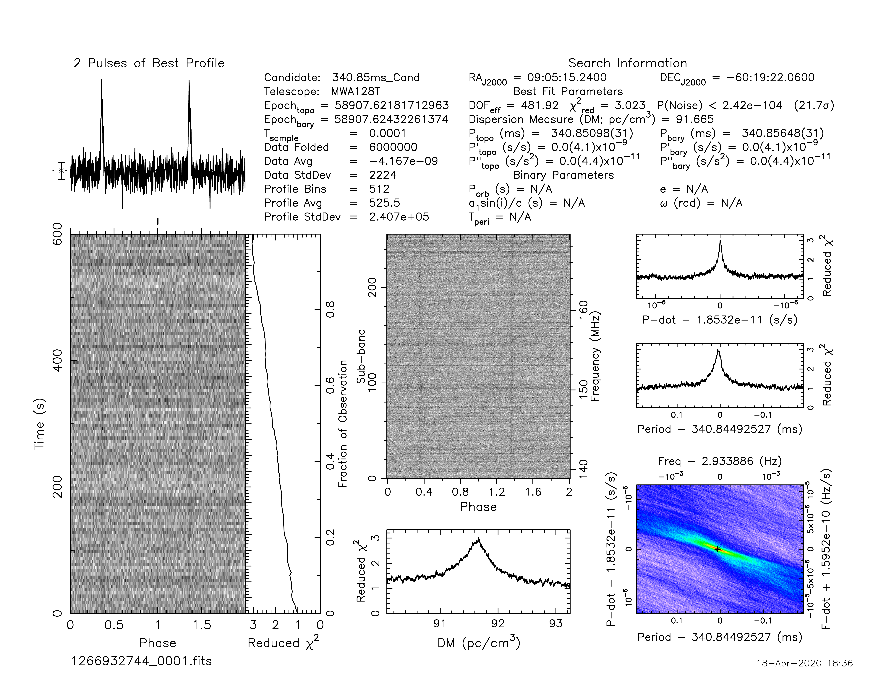

J0905-6019
==========

Flux Density Results
--------------------
.. csv-table:: J0905-6019 flux density total results
   :header: "N obs", "Flux Density (mJy)", " u_S_mean", "u_scint", "m_r_v"

   "2",  "29.0±9.9", "8.1", "8.8", "0.303"

.. csv-table:: J0905-6019 flux density individual results
   :header: "ObsID", "Flux Density (mJy)"

    "1266329600", "30.6±6.8"
    "1266932744", "27.4±4.3"

Comparison Fit
--------------
.. image:: comparison_fits/J0905-6019_comparison_fit.png
  :width: 800

Detection Plots
---------------

.. image:: on_pulse_plots/1266329600_J0905-6019_256_bins_gaussian_components.png
  :width: 800

.. image:: on_pulse_plots/1266932744_J0905-6019_512_bins_gaussian_components.png
  :width: 800