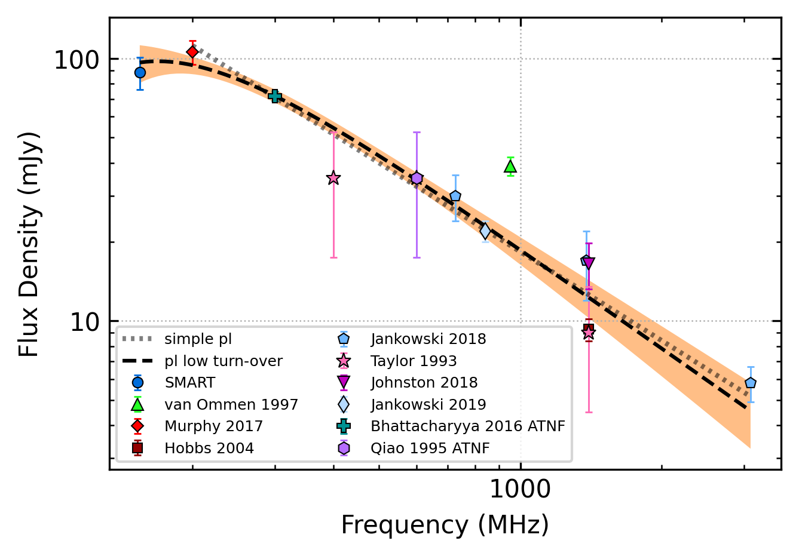
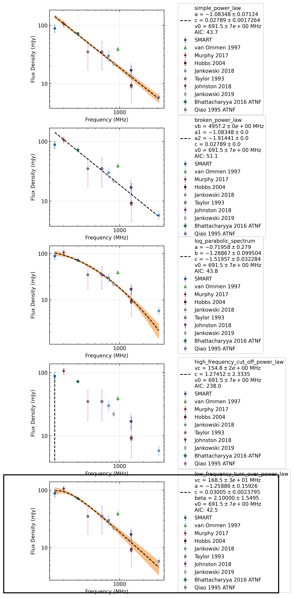
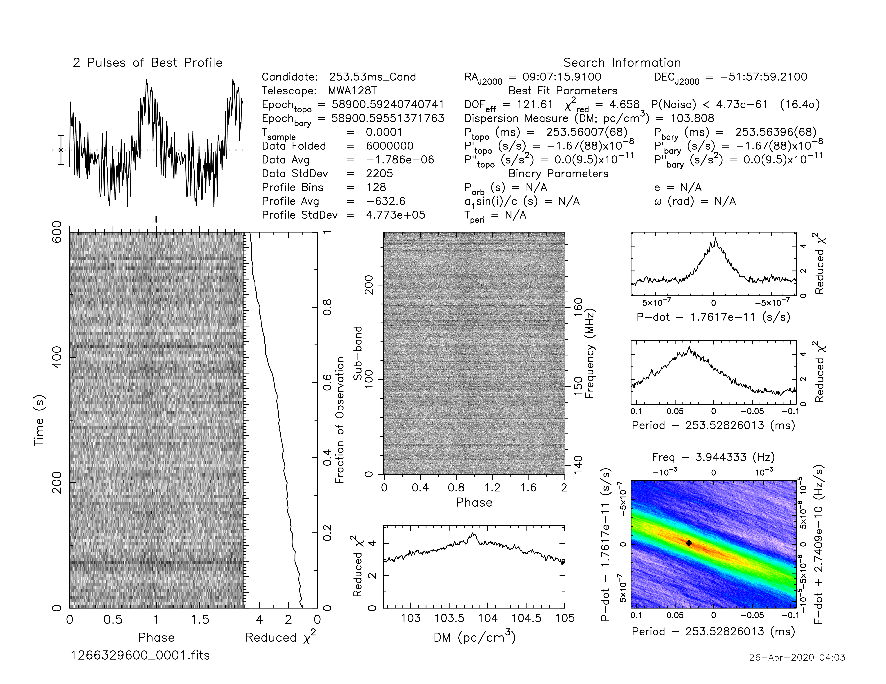
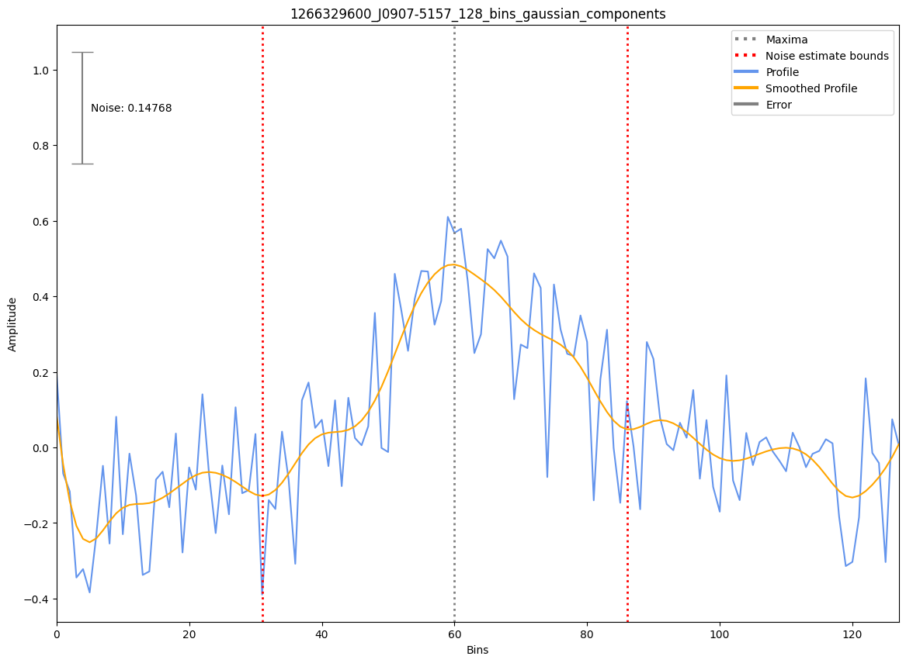

.. _J0907-5157:
J0907-5157
==========

Best Fit
--------

.. csv-table:: J0907-5157 fit results
   :header: "model","a","b","v0 (MHz)"

   "simple_power_law","-1.10±0.07","0.03±0.00","691±6"

Fit Before MWA
--------------

.. csv-table:: J0907-5157 before fit results
   :header: "model","a","b","v0 (MHz)"

   "simple_power_law","-1.12±0.08","0.02±0.00","787±7"

Flux Density Results
--------------------
.. csv-table:: J0907-5157 flux density total results
   :header: "N obs", "Flux Density (mJy)", "u_S_mean", "u_scint", "m_r_v"

   "1",  "88.5±28.2", "12.5", "25.3", "0.286"

.. csv-table:: J0907-5157 flux density individual results
   :header: "ObsID", "Flux Density (mJy)"

    "1266329600", "88.5±12.5"

Comparison Fit
--------------

Detection Plots
---------------

