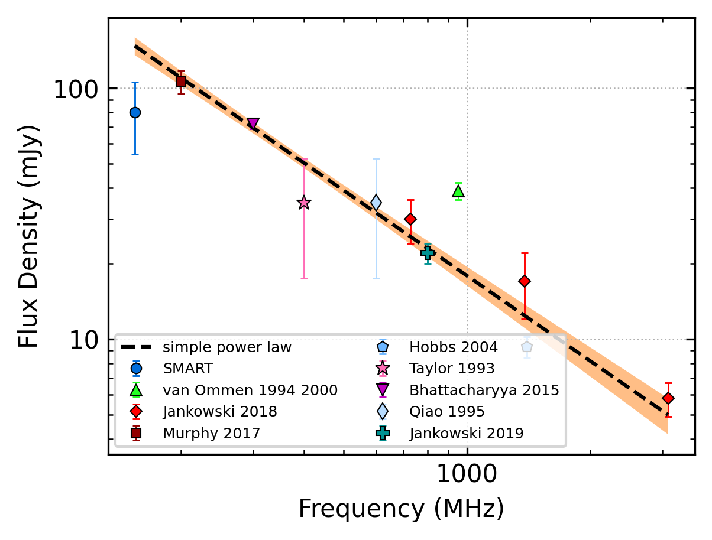
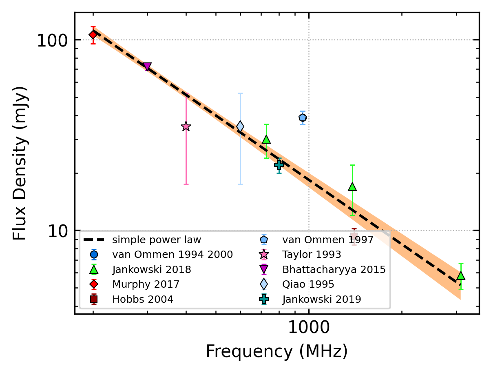

J0907-5157
==========

Best Fit
--------

.. csv-table:: J0907-5157 fit results
   :header: "model","a","b"

   "simple_power_law","-1.13±0.07","0.01±0.00"

Fit Before MWA
--------------

.. csv-table:: J0907-5157 before fit results
   :header: "model","a","b"

   "simple_power_law","-1.16±0.08","0.01±0.00"

Flux Density Results
--------------------
.. csv-table:: J0907-5157 flux density total results
   :header: "N obs", "Flux Density (mJy)", " u_S_mean", "u_scint", "m_r_v"

   "1",  "79.9±25.5", "11.3", "22.9", "0.286"

.. csv-table:: J0907-5157 flux density individual results
   :header: "ObsID", "Flux Density (mJy)"

    "1266329600", "79.9±11.3"

Comparison Fit
--------------
.. image:: comparison_fits/J0907-5157_comparison_fit.png
  :width: 800

Detection Plots
---------------

.. image:: detection_plots/1266329600_J0907-5157.prepfold.png
  :width: 800

.. image:: on_pulse_plots/1266329600_J0907-5157_128_bins_gaussian_components.png
  :width: 800