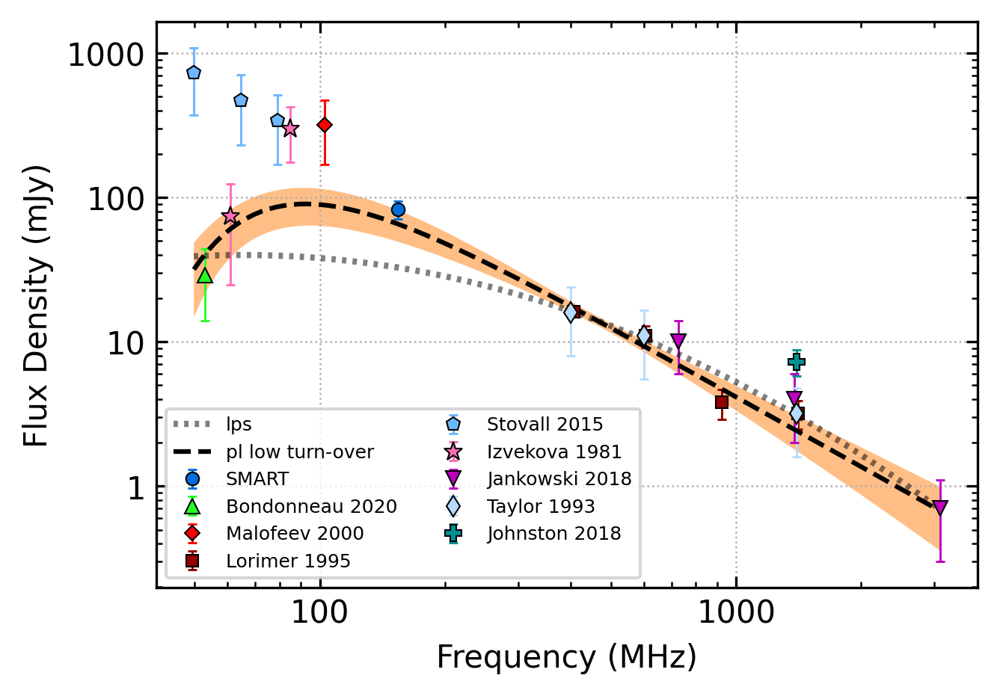

.. _J0908-1739:
J0908-1739
==========

Best Fit
--------

.. csv-table:: J0908-1739 fit results
   :header: "model","vc (MHz)","a","c","beta","v0 (MHz)"

   "low_frequency_turn_over_power_law","92±8","-1.61±0.25","0.02±0.00","2.10±0.41","392±3"

Fit Before MWA
--------------

.. csv-table:: J0908-1739 before fit results
   :header: "model","vpeak (MHz)","a","c","beta","v0 (MHz)"

   "log_parabolic_spectrum","-0.63±0.22","-0.98±0.15","-1.78±0.04","392±3"

Flux Density Results
--------------------
.. csv-table:: J0908-1739 flux density total results
   :header: "N obs", "Flux Density (mJy)", "u_S_mean", "u_scint", "m_r_v"

   "2",  "82.5±40.2", "11.9", "57.0", "0.691"

.. csv-table:: J0908-1739 flux density individual results
   :header: "ObsID", "Flux Density (mJy)"

    "1265470568", "103.0±10.0"
    "1267283936", "62.1±6.4"

Comparison Fit
--------------
.. image:: comparison_fits/J0908-1739_comparison_fit.png
  :width: 800

Detection Plots
---------------

.. image:: detection_plots/1265470568_J0908-1739.prepfold.png
  :width: 800

.. image:: on_pulse_plots/1265470568_J0908-1739_1024_bins_gaussian_components.png
  :width: 800
.. image:: detection_plots/1267283936_J0908-1739.prepfold.png
  :width: 800

.. image:: on_pulse_plots/1267283936_J0908-1739_1024_bins_gaussian_components.png
  :width: 800