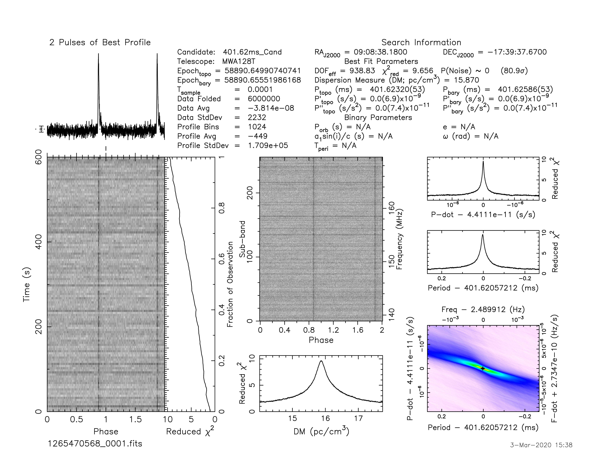

.. _J0908-1739:
J0908-1739
==========

Best Fit
--------
.. image:: best_fits/J0908-1739_o_fit.png
  :width: 800

.. csv-table:: J0908-1739 fit results
   :header: "model","a","b","c","v0 (MHz)"

   "o","-0.66±0.23","-1.02±0.16","-1.78±0.03","392±3"

Fit Before MWA
--------------

.. csv-table:: J0908-1739 before fit results
   :header: "model","a","b","c","v0 (MHz)"

   "o","-0.67±0.23","-1.01±0.16","-1.78±0.03","392±3"

Flux Density Results
--------------------
.. csv-table:: J0908-1739 flux density total results
   :header: "N obs", "Flux Density (mJy)", "u_S_mean", "u_scint", "m_r_v"

   "2",  "82.5±40.2", "11.9", "57.0", "0.691"

.. csv-table:: J0908-1739 flux density individual results
   :header: "ObsID", "Flux Density (mJy)"

    "1265470568", "103.0±10.0"
    "1267283936", "62.1±6.4"

Comparison Fit
--------------
.. image:: comparison_fits/J0908-1739_comparison_fit.png
  :width: 800

Detection Plots
---------------

.. image:: on_pulse_plots/1265470568_J0908-1739_1024_bins_gaussian_components.png
  :width: 800
.. image:: detection_plots/1267283936_J0908-1739.prepfold.png
  :width: 800

.. image:: on_pulse_plots/1267283936_J0908-1739_1024_bins_gaussian_components.png
  :width: 800