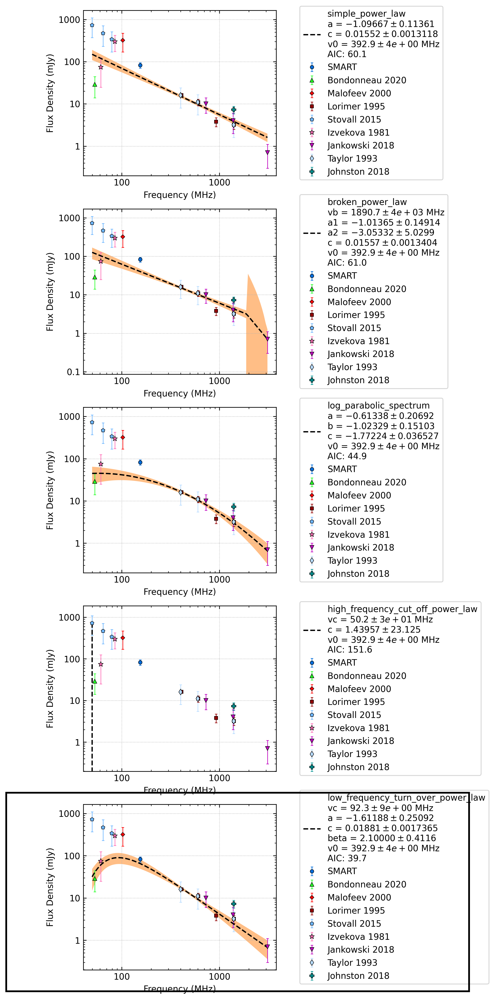

J0908-1739
==========

Best Fit
--------
.. image:: best_fits/J0908-1739_simple_power_law_fit.png
  :width: 800

.. csv-table:: J0908-1739 fit results
   :header: "model","a","b"

   "simple_power_law","-1.36±0.13","0.00±0.00"

Fit Before MWA
--------------
.. image:: before_mwa/J0908-1739_simple_power_law_fit.png
  :width: 800

.. csv-table:: J0908-1739 before fit results
   :header: "model","a","b"

   "simple_power_law","-1.35±0.13","0.00±0.00"

Flux Density Results
--------------------
.. csv-table:: J0908-1739 flux density total results
   :header: "N obs", "Flux Density (mJy)", "u_S_mean", "u_scint", "m_r_v"

   "2",  "73.4±35.9", "10.6", "50.7", "0.691"

.. csv-table:: J0908-1739 flux density individual results
   :header: "ObsID", "Flux Density (mJy)"

    "1265470568", "92.2±8.9"
    "1267283936", "54.6±5.7"

Comparison Fit
--------------

Detection Plots
---------------

.. image:: detection_plots/1265470568_J0908-1739.prepfold.png
  :width: 800

.. image:: on_pulse_plots/1265470568_J0908-1739_1024_bins_gaussian_components.png
  :width: 800
.. image:: detection_plots/1267283936_J0908-1739.prepfold.png
  :width: 800

.. image:: on_pulse_plots/1267283936_J0908-1739_1024_bins_gaussian_components.png
  :width: 800