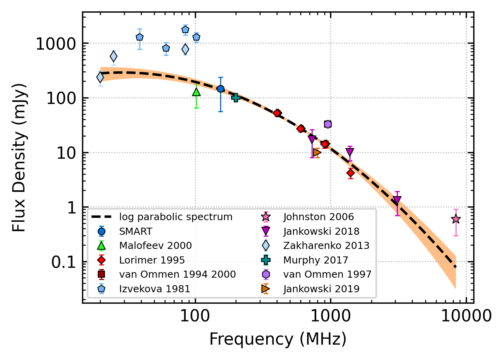
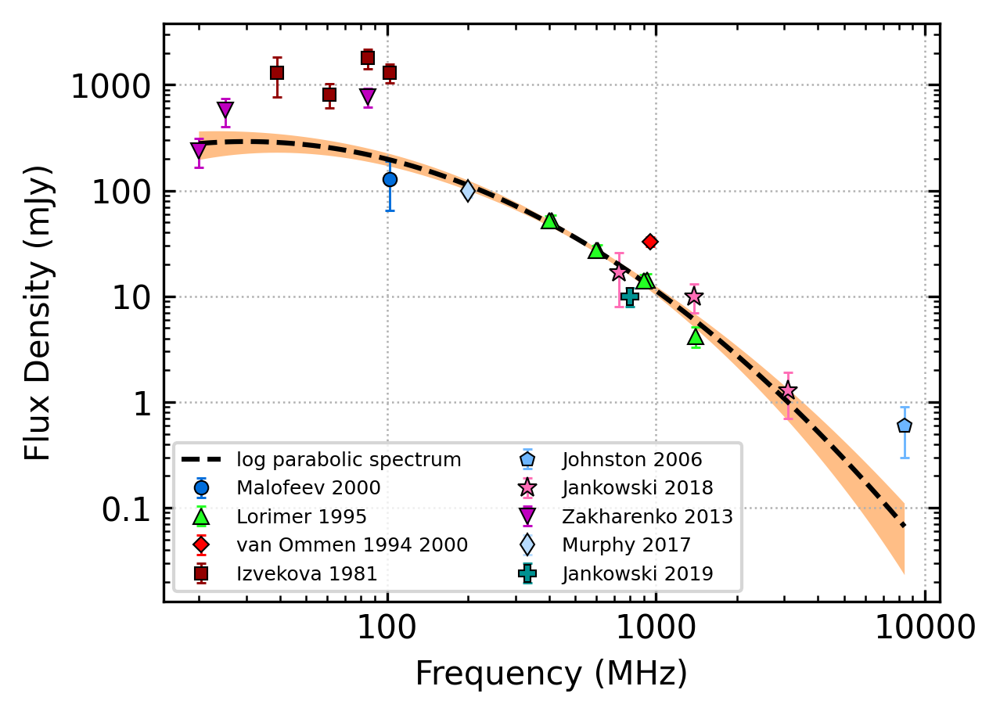
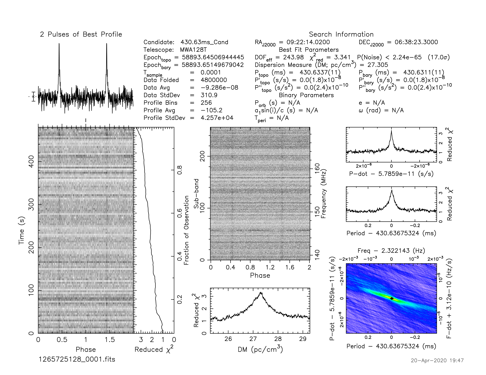
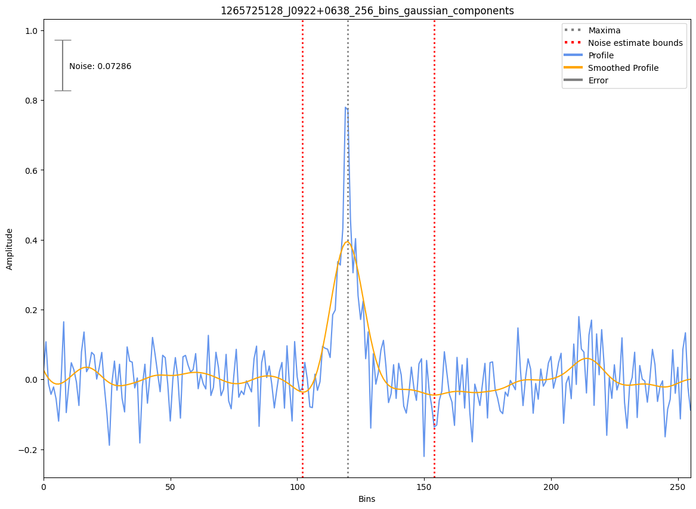
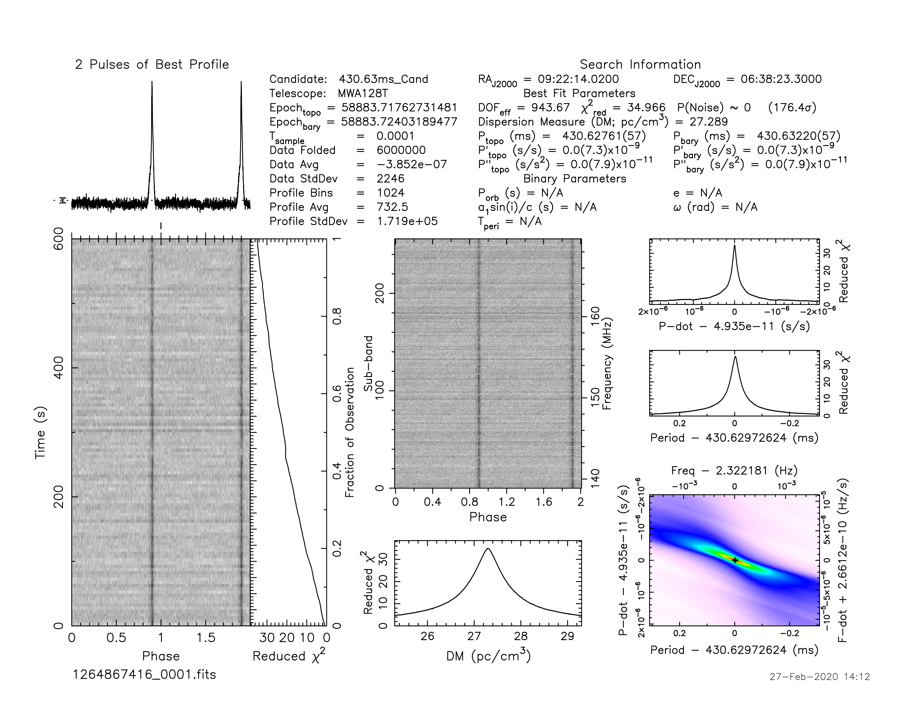
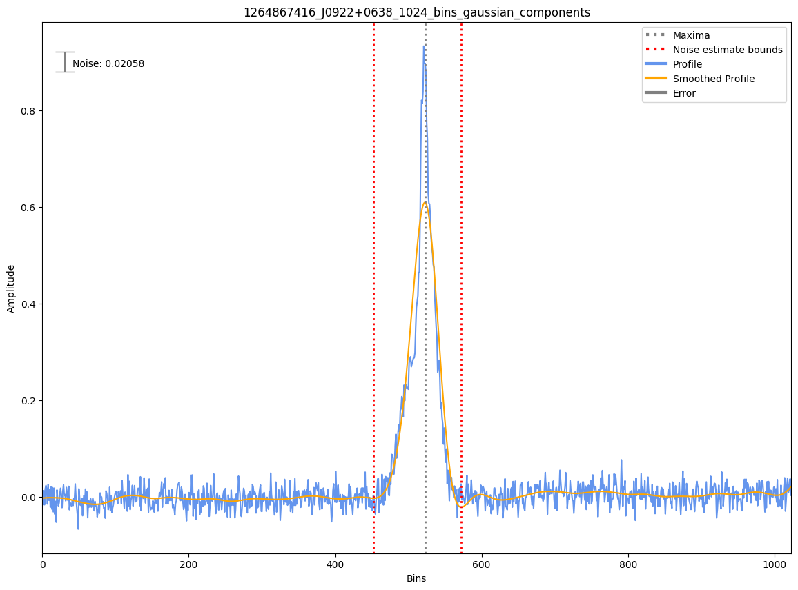
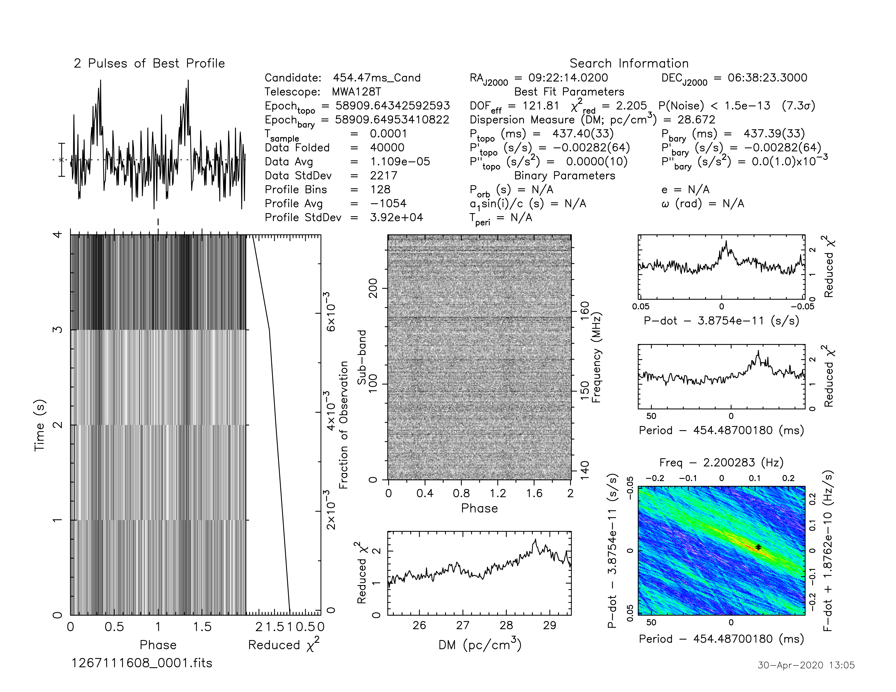

.. _J0922+0638:
J0922+0638
==========

Best Fit
--------

.. csv-table:: J0922+0638 fit results
   :header: "model","a","b","c","v0 (MHz)"

   "log_parabolic_spectrum","-0.59±0.12","-1.38±0.10","-1.33±0.03","409±4"

Fit Before MWA
--------------

.. csv-table:: J0922+0638 before fit results
   :header: "model","a","b","c","v0 (MHz)"

   "log_parabolic_spectrum","-0.59±0.12","-1.38±0.10","-1.33±0.03","409±4"

Flux Density Results
--------------------
.. csv-table:: J0922+0638 flux density total results
   :header: "N obs", "Flux Density (mJy)", "u_S_mean", "u_scint", "m_r_v"

   "3",  "168.1±104.5", "70.3", "90.0", "0.535"

.. csv-table:: J0922+0638 flux density individual results
   :header: "ObsID", "Flux Density (mJy)"

    "1265725128", "35.5±7.8"
    "1264867416", "184.3±16.8"
    "1267111608", "284.5±67.8"

Comparison Fit
--------------
.. image:: comparison_fits/J0922+0638_comparison_fit.png
  :width: 800

Detection Plots
---------------

.. image:: on_pulse_plots/1267111608_J0922+0638_128_bins_gaussian_components.png
  :width: 800