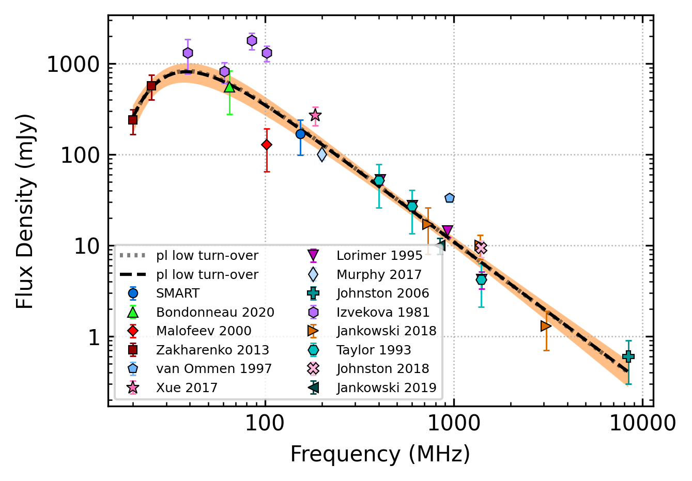
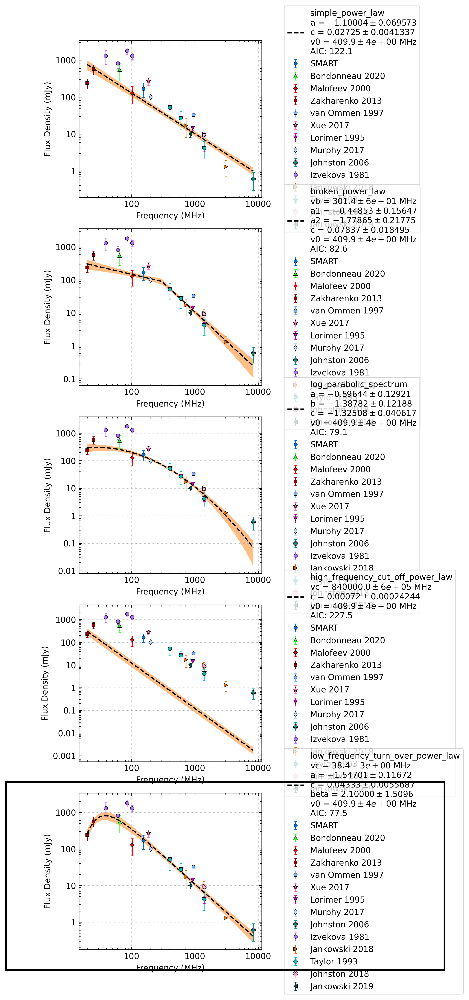

.. _J0922+0638:
J0922+0638
==========

Best Fit
--------

.. csv-table:: J0922+0638 fit results
   :header: "model","vc (MHz)","a","b","beta","v0 (MHz)"

   "low_frequency_turn_over_power_law","37±2","-1.52±0.12","0.04±0.01","2.10±1.44","409±4"

Fit Before MWA
--------------

.. csv-table:: J0922+0638 before fit results
   :header: "model","vc (MHz)","a","b","beta","v0 (MHz)"

   "low_frequency_turn_over_power_law","38±2","-1.55±0.12","0.04±0.00","2.10±1.54","409±4"

Flux Density Results
--------------------
.. csv-table:: J0922+0638 flux density total results
   :header: "N obs", "Flux Density (mJy)", "u_S_mean", "u_scint", "m_r_v"

   "2",  "109.9±63.7", "18.6", "58.8", "0.535"

.. csv-table:: J0922+0638 flux density individual results
   :header: "ObsID", "Flux Density (mJy)"

    "1265725128", "35.5±7.8"
    "1264867416", "184.3±16.8"
    "1267111608", "nan±nan"

Comparison Fit
--------------

Detection Plots
---------------

.. image:: detection_plots/1265725128_J0922+0638.prepfold.png
  :width: 800

.. image:: on_pulse_plots/1265725128_J0922+0638_256_bins_gaussian_components.png
  :width: 800

.. image:: on_pulse_plots/1264867416_J0922+0638_1024_bins_gaussian_components.png
  :width: 800
.. image:: detection_plots/pf_1267111608_J0922+0638_09:22:14.02_+06:38:23.30_b1024_430.27ms_Cand.pfd.png
  :width: 800

.. image:: on_pulse_plots/1267111608_J0922+0638_128_bins_gaussian_components.png
  :width: 800