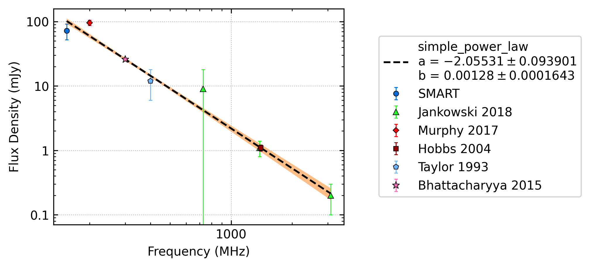
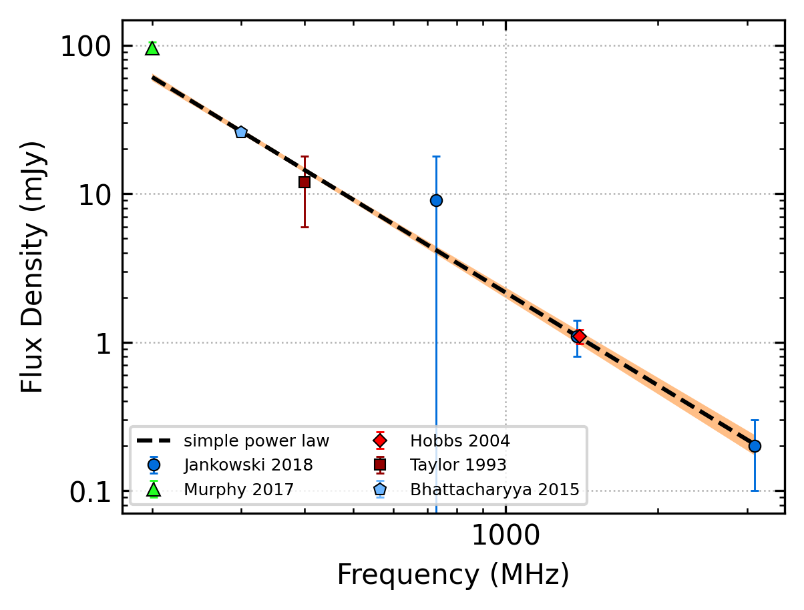
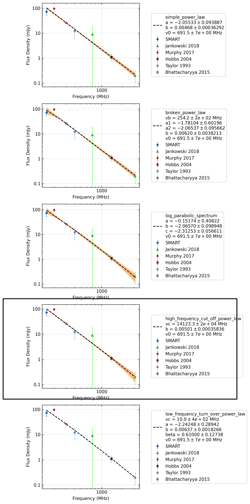
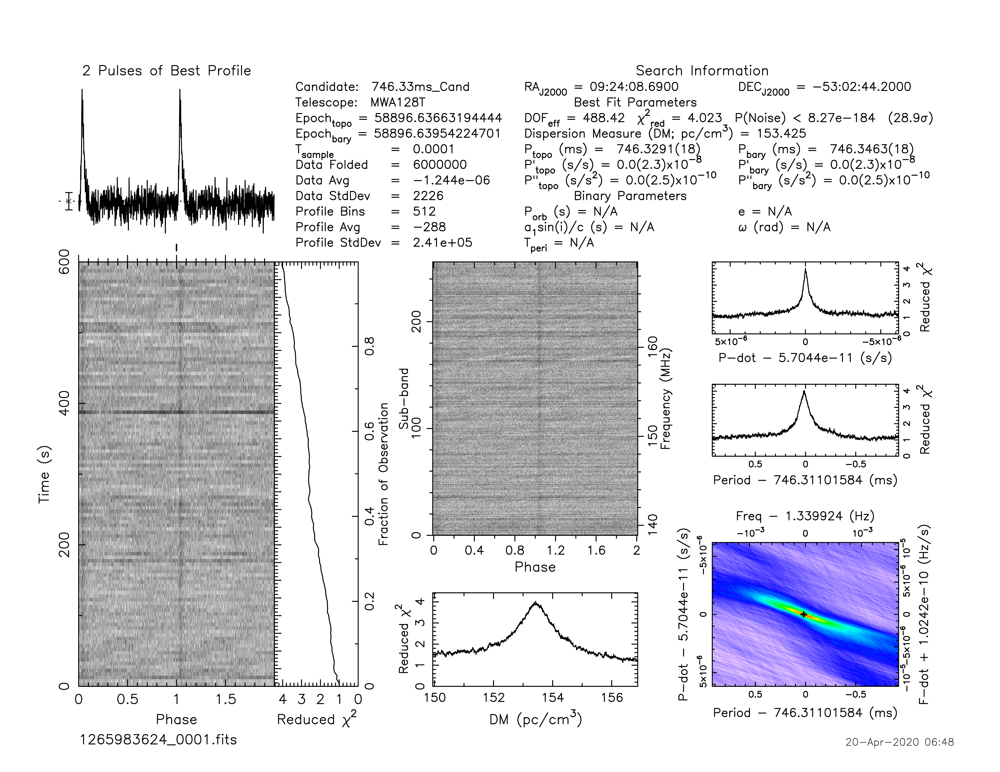
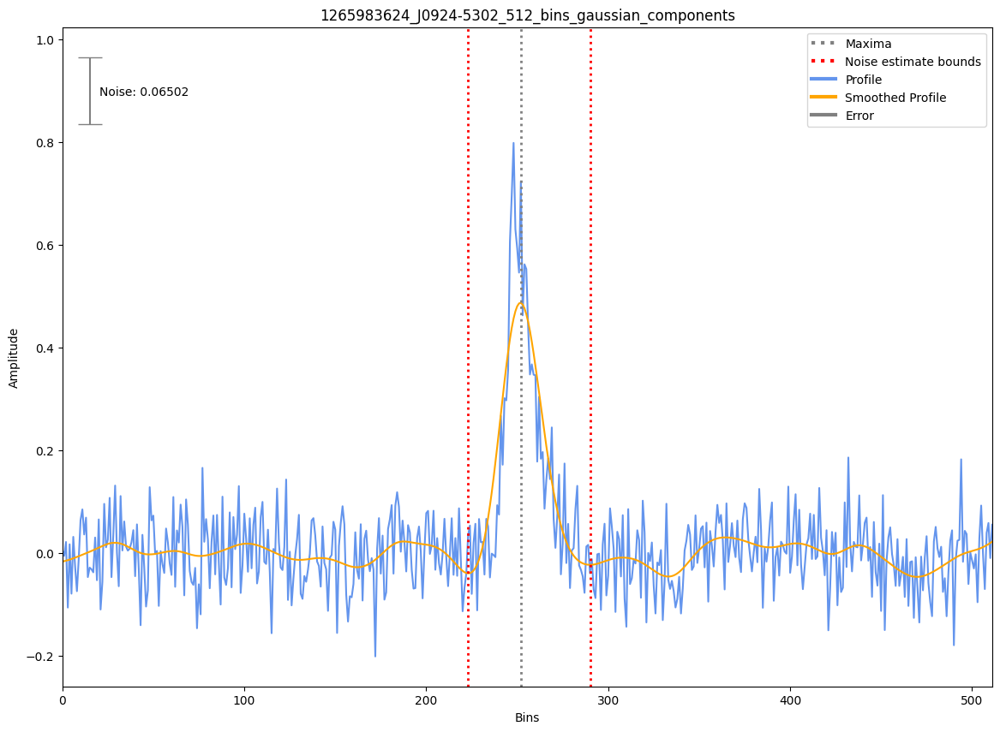
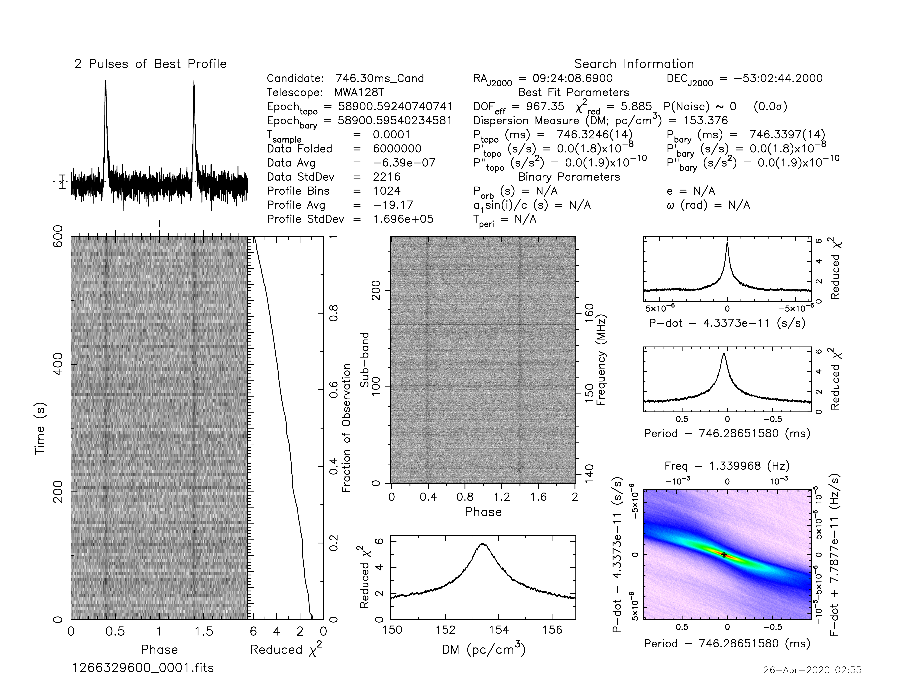
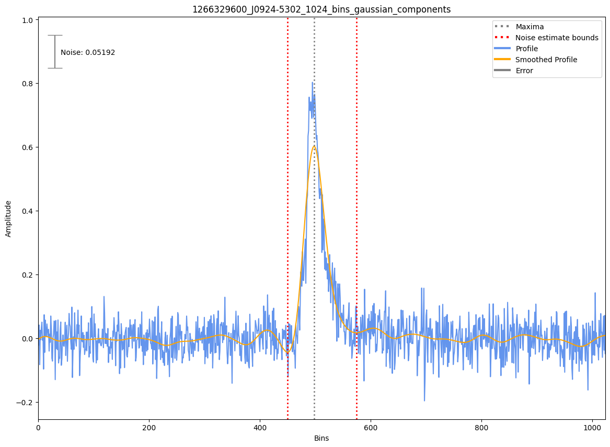
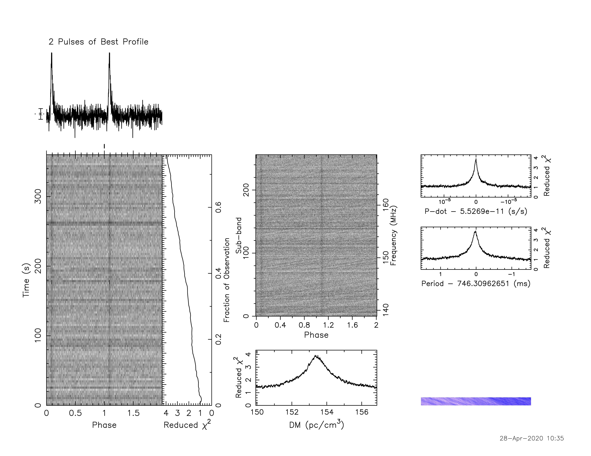
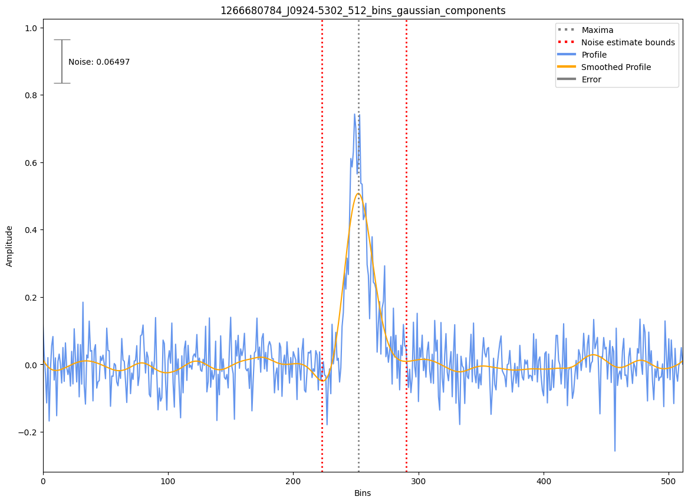

.. _J0924-5302:
J0924-5302
==========

Best Fit
--------

.. csv-table:: J0924-5302 fit results
   :header: "model","a","b"

   "simple_power_law","-2.06±0.09","0.00±0.00"

Fit Before MWA
--------------

.. csv-table:: J0924-5302 before fit results
   :header: "model","a","b"

   "simple_power_law","-2.08±0.10","0.00±0.00"

Flux Density Results
--------------------
.. csv-table:: J0924-5302 flux density total results
   :header: "N obs", "Flux Density (mJy)", "u_S_mean", "u_scint", "m_r_v"

   "4",  "72.2±19.7", "16.4", "17.2", "0.238"

.. csv-table:: J0924-5302 flux density individual results
   :header: "ObsID", "Flux Density (mJy)"

    "1265983624", "56.9±8.1"
    "1266329600", "115.3±10.2"
    "1266932744", "52.8±5.3"
    "1266680784", "63.6±8.5"

Comparison Fit
--------------

Detection Plots
---------------

.. image:: detection_plots/1266932744_J0924-5302.prepfold.png
  :width: 800

.. image:: on_pulse_plots/1266932744_J0924-5302_1024_bins_gaussian_components.png
  :width: 800

