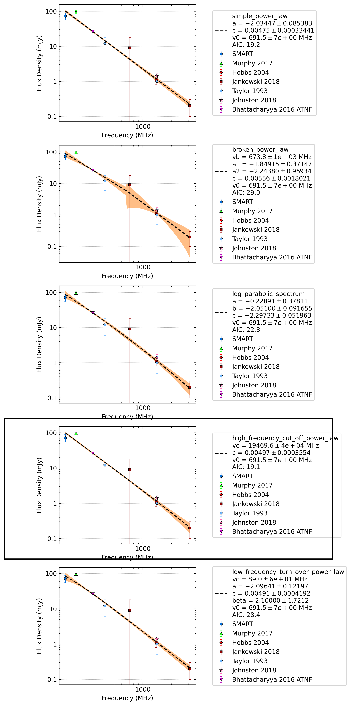

J0924-5302
==========

Best Fit
--------
.. image:: best_fits/J0924-5302_simple_power_law_fit.png
  :width: 800

.. csv-table:: J0924-5302 fit results
   :header: "model","a","b"

   "simple_power_law","-2.06±0.07","0.00±0.00"

Fit Before MWA
--------------
.. image:: before_mwa/J0924-5302_simple_power_law_fit.png
  :width: 800

.. csv-table:: J0924-5302 before fit results
   :header: "model","a","b"

   "simple_power_law","-2.08±0.07","0.00±0.00"

Flux Density Results
--------------------
.. csv-table:: J0924-5302 flux density total results
   :header: "N obs", "Flux Density (mJy)", " u_S_mean", "u_scint", "m_r_v"

   "4",  "64.1±17.5", "14.6", "15.3", "0.238"

.. csv-table:: J0924-5302 flux density individual results
   :header: "ObsID", "Flux Density (mJy)"

    "1265983624", "51.2±7.3"
    "1266329600", "104.1±9.2"
    "1266932744", "45.2±4.5"
    "1266680784", "55.9±7.5"

Comparison Fit
--------------

Detection Plots
---------------

.. image:: on_pulse_plots/1265983624_J0924-5302_512_bins_gaussian_components.png
  :width: 800

.. image:: on_pulse_plots/1266329600_J0924-5302_1024_bins_gaussian_components.png
  :width: 800
.. image:: detection_plots/1266932744_J0924-5302.prepfold.png
  :width: 800

.. image:: on_pulse_plots/1266932744_J0924-5302_1024_bins_gaussian_components.png
  :width: 800
.. image:: detection_plots/1266680784_J0924-5302.prepfold.png
  :width: 800

.. image:: on_pulse_plots/1266680784_J0924-5302_512_bins_gaussian_components.png
  :width: 800