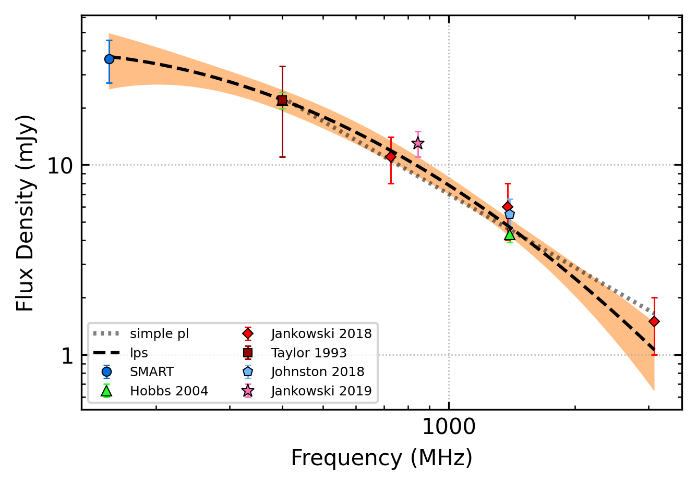

.. _J0924-5814:
J0924-5814
==========

Best Fit
--------

.. csv-table:: J0924-5814 fit results
   :header: "model","a","c","v0 (MHz)"

   "simple_power_law","-1.08±0.14","0.01±0.00","691±6"

Fit Before MWA
--------------

.. csv-table:: J0924-5814 before fit results
   :header: "model","a","c","v0 (MHz)"

   "simple_power_law","-1.40±0.25","0.01±0.00","1113±11"

Flux Density Results
--------------------
.. csv-table:: J0924-5814 flux density total results
   :header: "N obs", "Flux Density (mJy)", "u_S_mean", "u_scint", "m_r_v"

   "2",  "36.2±13.3", "9.1", "13.7", "0.378"

.. csv-table:: J0924-5814 flux density individual results
   :header: "ObsID", "Flux Density (mJy)"

    "1266329600", "42.8±7.4"
    "1266932744", "29.5±5.4"

Comparison Fit
--------------
.. image:: comparison_fits/J0924-5814_comparison_fit.png
  :width: 800

Detection Plots
---------------

.. image:: detection_plots/1266329600_J0924-5814.prepfold.png
  :width: 800

.. image:: on_pulse_plots/1266329600_J0924-5814_256_bins_gaussian_components.png
  :width: 800
.. image:: detection_plots/1266932744_J0924-5814.prepfold.png
  :width: 800

.. image:: on_pulse_plots/1266932744_J0924-5814_256_bins_gaussian_components.png
  :width: 800